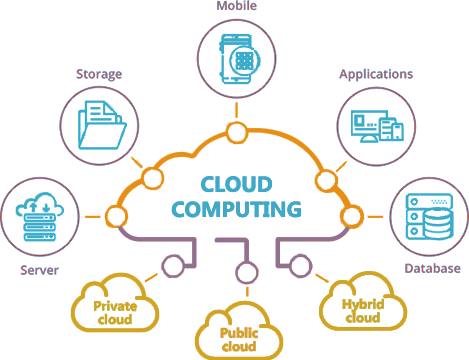

Microsoft Azure, commonly referred to as Azure, is a cloud computing service created by Microsoft for building, testing, deploying, and managing applications and services through Microsoft-managed data centers. It provides software as a service (SaaS), platform as a service (PaaS) and infrastructure as a service (IaaS) and supports many different programming languages, tools, and frameworks, including both Microsoft-specific and third-party software and systems.

## Overview

In this article, we'll try to understand definition of cloud computing, some of the basic cloud computing concepts like availability, scalability etc., and go through the main services provided by Azure. This article will also help in preparing for one of the basic cloud certification exams - AZ 900: Azure Fundamentals.

## Introduction

Simply put, cloud computing is the delivery of computing services – including servers, storage, databases, networking, software, analytics and intelligence – over the Internet (“the cloud”) to offer faster innovation, flexible resources and economies of scale. Typically, you only pay for cloud services you use, helping you lower your operating costs, run your infrastructure more efficiently and scale as your business needs change.

Cloud computing is the on-demand availability of computer system resources, especially data storage (cloud storage) and computing power, without direct active management by the user. The term is generally used to describe data centers available to many users over the Internet. Large clouds, predominant today, often have functions distributed over multiple locations from central servers. If the connection to the user is relatively close, it may be designated an edge server.

Clouds may be limited to a single organization (enterprise clouds), or be available to multiple organizations (public cloud). Cloud computing relies on sharing of resources to achieve coherence and economies of scale. Advocates of public and hybrid clouds note that cloud computing allows companies to avoid or minimize up-front IT infrastructure costs. Proponents also claim that cloud computing allows enterprises to get their applications up and running faster, with improved manageability and less maintenance, and that it enables IT teams to more rapidly adjust resources to meet fluctuating and unpredictable demand, providing the burst computing capability: high computing power at certain periods of peak demand.

Cloud providers typically use a "pay-as-you-go" model, which can lead to unexpected operating expenses if administrators are not familiarized with cloud-pricing models. The availability of high-capacity networks, low-cost computers and storage devices as well as the widespread adoption of hardware virtualization, service-oriented architecture and autonomic and utility computing has led to growth in cloud computing. As of 2017, most cloud computers run a Linux-based operating system.

## Benefits of cloud computing

Cloud computing is a big shift from the traditional way businesses think about IT resources. Here are seven common reasons why organisations are turning to cloud computing services:

- **Cost**: Cloud computing eliminates the capital expense of buying hardware and software and setting up and running on-site data centres – the racks of servers, the round-the-clock electricity for power and cooling and the IT experts for managing the infrastructure. It adds up quickly.

- **Speed**: Most cloud computing services are provided as self service and on demand, so even vast amounts of computing resources can be provisioned in minutes, typically with just a few mouse clicks, giving businesses a lot of flexibility and taking the pressure off capacity planning.

- **Global scale**: The benefits of cloud computing services include the ability to scale elastically. In cloud speak, that means delivering the right amount of IT resources – for example, more or less computing power, storage, bandwidth – right when they’re needed, and from the right geographic location.

- **Productivity**: On-site data centres typically require a lot of “racking and stacking” – hardware setup, software patching and other time-consuming IT management chores. Cloud computing removes the need for many of these tasks, so IT teams can spend time on achieving more important business goals.

- **Performance**: The biggest cloud computing services run on a worldwide network of secure data centres, which are regularly upgraded to the latest generation of fast and efficient computing hardware. This offers several benefits over a single corporate data centre, including reduced network latency for applications and greater economies of scale.

- **Reliability**: Cloud computing makes data backup, disaster recovery and business continuity easier and less expensive because data can be mirrored at multiple redundant sites on the cloud provider’s network.

- **Security**: Many cloud providers offer a broad set of policies, technologies and controls that strengthen your security posture overall, helping to protect your data, apps and infrastructure from potential threats.

## Types of cloud computing

Not all clouds are the same and not one type of cloud computing is right for everyone. Several different models, types and services have evolved to help offer the right solution for your needs.

First, you need to determine the type of cloud deployment, or cloud computing architecture, that your cloud services will be implemented on. There are three different ways to deploy cloud services: on a public cloud, private cloud or hybrid cloud.

### Public cloud

Public clouds are owned and operated by third-party cloud service providers, who deliver their computing resources such as servers and storage over the Internet. Microsoft Azure is an example of a public cloud. With a public cloud, all hardware, software and other supporting infrastructure are owned and managed by the cloud provider. You access these services and manage your account using a web browser.

### Private cloud

A private cloud refers to cloud computing resources used exclusively by a single business or organisation. A private cloud can be physically located on the company’s on-site data centre. Some companies also pay third-party service providers to host their private cloud. A private cloud is one in which the services and infrastructure are maintained on a private network.

### Hybrid cloud

Hybrid clouds combine public and private clouds, bound together by technology that allows data and applications to be shared between them. By allowing data and applications to move between private and public clouds, a hybrid cloud gives your business greater flexibility, more deployment options and helps optimise your existing infrastructure, security and compliance.

## Types of cloud services

Most cloud computing services fall into three broad categories: infrastructure as a service (IaaS), platform as a service (PaaS), and software as a service (SaaS). These are sometimes called the cloud computing stack because they build on top of one another. Knowing what they are and how they’re different makes accomplishing your business goals easier.

### Infrastructure-as-a-Service (IaaS) (shared responsibility model)

Infrastructure as a Service is the most flexible category of cloud services. It aims to give you complete control over the hardware that runs your application (IT infrastructure servers and virtual machines (VMs), storage, networks, and operating systems). Instead of buying hardware, with IaaS, you rent it. It's an instant computing infrastructure, provisioned and managed over the internet.

### Platform-as-a-Service (PaaS)

PaaS provides an environment for building, testing, and deploying software applications. The goal of PaaS is to help you create an application quickly without managing the underlying infrastructure. For example, when deploying a web application using PaaS, you don't have to install an operating system, web server, or even system updates. PaaS is a complete development and deployment environment in the cloud.

### Software-as-a-Service (SaaS)

SaaS is software that is centrally hosted and managed for the end customer. It is usually based on an architecture where one version of the application is used for all customers, and licensed through a monthly or annual subscription. Office 365, Skype, and Dynamics CRM Online are perfect examples of SaaS software.

## Uses of cloud computing

You’re probably using cloud computing right now, even if you don’t realise it. If you use an online service to send emails, edit documents, watch films or TV, listen to music, play games, or store pictures and other files, it’s likely that cloud computing is making it all possible behind the scenes. The first cloud computing services are barely a decade old, but already a variety of organisations – from tiny start-ups to global corporations, from government agencies to non-profits – are embracing the technology for all sorts of reasons.

Here are a few examples of what’s possible today with cloud services from a cloud provider:

- **Create cloud-native applications**: Quickly build, deploy and scale applications – web, mobile and API. Take advantage of cloud-native technologies and approaches, such as containers, Kubernetes, microservices architecture, API-driven communication and DevOps.

- **Test and build applications**: Reduce application development cost and time by using cloud infrastructures that can easily be scaled up or down.

- **Store, back up and recover data**: Protect your data more cost-efficiently – and at massive scale – by transferring your data over the Internet to an offsite cloud storage system that’s accessible from any location and any device.

- **Analyse data**: Unify your data across teams, divisions and locations in the cloud. Then use cloud services, such as machine learning and artificial intelligence, to uncover insights for more informed decisions.

- **Stream audio and video**: Connect with your audience whenever, wherever, on any device with high-definition video and audio with global distribution.

- **Embed intelligence**: Use intelligent models to help engage customers and provide valuable insights from the data captured.

- **Deliver software on demand**: Also known as software as a service (SaaS), on-demand software lets you offer the latest software versions and updates around to customers – whenever they need it, regardless of where they are.

## Cloud Computing Concepts and Terminologies

- **High Availability (HA)**: A design that maximises service accessibility. It is the ability of the application or service to continue running in a healthy state, without significant downtime. By "healthy state," we mean the application is responsive, and users can connect to the application and interact with it.

- **Scalability**: Increase or decrease the resources and services used based on the demand or workload at any given time. Vertical Scaling (aka "scaling up) - add more resources to existing servers. Horizontal Scaling (aka "scaling out) - add more servers.

- **Vertical Scaling (aka "scaling up")**:The process of adding resources to increase the power of an existing server (e.g. adding a faster CPU, additional CPUs, more memory).

- **Horizontal Scaling (aka "scaling out")**: The process of adding more servers that function together as one unit (e.g. adding more servers).

- **Elasticity**: The ability to dynamically scale out or scale in resources based on workload. You automatically scale
  out compute power or storage, then it scales in once it’s no longer needed.

- **Cloud Agility**: Cloud agility is the ability to rapidly change an IT infrastructure in order to adapt to the evolving needs of the business (e.g. if your service peaks one month, you can scale to demand and pay a larger bill for the month. If the following month the demand drops, you can reduce the used resources and be charged less).

- **Fault Tolerance**: Redundancy is often built into cloud services architecture so if one component fails, a backup component takes its place. This is referred to as fault tolerance and it ensures that your customers aren't impacted when an unexpected accident occurs.

- **Disaster Recovery**: The ability to recover from rare but major incidents: non-transient, wide-scale failures, such as service disruption that affects an entire region. Disaster recovery includes data backup and archiving, and may include manual intervention, such as restoring a database from backup.

- **Economies of Scale**: Economies of scale is the ability to do things more efficiently or at a lower-cost per unit when operating at a larger scale (e.g. the ability to acquire hardware at a lower cost than if a single user or smaller business were purchasing it, cloud providers can also make deals with local governments and utilities to get tax savings, lower pricing on power, cooling, and high-speed network connectivity between sites).

- **Capital Expenditure (CapEx)**: CapEx is the spending of money on physical infrastructure up front, and then deducting that expense from your tax bill over time. CapEx is an upfront cost, which has a value that reduces over time.

- **Operational Expenditure (OpEx)**: OpEx is spending money on services or products now and being billed for them now. You can deduct this expense from your tax bill in the same year. There is no upfront cost, you pay for a service or product as you use it.

- **Geography** (Americas, Europe, Asia Pacific, Middle East and Africa): An Azure geography is a discrete market typically containing two or more regions that preserve data residency and compliance boundaries.

- **Region** (e.g. North Europe, West Europe, Germany North, Germany West Central): A region is a geographical area on the planet containing at least one, but potentially multiple datacenters that are nearby and networked together with a low-latency network.

- **Availability Zone** (e.g. Zone 1, Zone 2, Zone 3 - within a particular region): Availability Zones are physically separate datacenters within an Azure region. Each Availability Zone is made up of one or more datacenters equipped with independent power, cooling, and networking.

- **Availability Sets**: Availability Sets comprise of update and fault domains.
  - Update Domain: When a maintenance event occurs, the update is sequenced through update domains.
  - Fault Domain: Fault domains provide for the physical separation of a workload across different hardware in the datacenter.

> Hierarchy: Geography > Region > Availability Zone > Availability Set > Fault Domain / Update Domain

- **Region Pair**:
  Each Azure region is always paired with another region within the same geography (such as US, Europe, or Asia) at least 300 miles away. This approach allows for the replication of resources (such as virtual machine storage) across a geography that helps reduce the likelihood of interruptions due to events such as natural disasters, civil unrest, power outages, or physical network outages affecting both regions at once.

- **Resource Group**:
  Resource groups are a fundamental element of the Azure platform. A resource group is a logical container for resources deployed on Azure.

- **Azure Resource Manager**:
  Azure Resource Manager is the interface for managing and organizing cloud resources. Think of Resource Manager as a way to deploy cloud resources.

### Compare & Contrast (Responsibilities)

|          | **User**                                                                                                                     | **Cloud Provider**                                                                                                                               |
| -------- | ---------------------------------------------------------------------------------------------------------------------------- | ------------------------------------------------------------------------------------------------------------------------------------------------ |
| **IaaS** | Purchase, installation, configuration, and management of their own software operating systems, middleware, and applications. | Responsible for ensuring that the underlying cloud infrastructure (such as virtual machines, storage, and networking) is available for the user. |
| **PaaS** | Responsible for the development of their own applications.                                                                   | Responsible for operating system management, and network and service configuration.                                                              |
| **SaaS** | Users just use the application software; they are not responsible for any maintenance or management of that software.        | The cloud provider is responsible for the provision, management, and maintenance of the application software.                                    |

### Compare & Contrast (Advantages & Disadvantages)

|         | **Advantages**                                                                                                                                         | **Disadvantages**                                                                                                                                                                                       |
| ------- | ------------------------------------------------------------------------------------------------------------------------------------------------------ | ------------------------------------------------------------------------------------------------------------------------------------------------------------------------------------------------------- |
| Public  | + High Scalability/Agility  + PAYG (No CapEx, OpEx model)  + Not responsible for hardware maintenance  + Minimal technical knowledge required | - May not be able to meet specific security requirements  - May not be able to meet specific compliance requirements  - You don't own the hardware and may not be able to manage them as you wish |
| Private | + You have complete control  + Can meet strict security and compliance requirements                                                                 | - Upfront CapEx costs  - Owning equipment limits agility to scale  - Requires high technical knowledge                                                                                            |
| Hybrid  | + Advantages of both Public and Private                                                                                                                | - Can be more expensive than selecting one deployment model  - Can be more complicated to set up and manage                                                                                          |

## Azure Services

Here's a big-picture view of the available services and features in Azure.

### Compute Services:​

These are a category of services in Azure that provides CPU cycles for rent. These services enable a user to deploy and manage VMs, containers and batch jobs, as well as support remote application access. Compute resources created within the Azure cloud can be configured with either public IP addresses or private IP addresses, depending on whether the resource needs to be accessible to the outside world.

- **Virtual Machines​** - looks, acts, feels, tastes like a real server in front of you; except that it’s running inside Azure’s data center in a virtualized environment; Azure supports Windows and Linux virtual machines, with dozens of varities of each; IaaS
- **Hypervisor**​ - a layer that runs on top of the physical server Operating System that allows multiple guest operating systems (virtual machines) to run in an isolated manner on top
- **Virtual Machine Scale Sets**​ - these are a set of identical virtual machines (from 1 to 1000 instances) that are designed to auto-scale up and down based on user demand; IaaS
- **App Services**​ - allows you to upload your code and configuration into Azure, and Azure will run the application as you specify; lots of integrations with Visual Studio, and otherfeatures and benefits provided on this platform; PaaS
- **Azure Functions**​ - small pieces of code that are designed to perform some task quickly;these are like connector code designed to do small things; serverless model
- **Azure Kubernetes Service** - Cluster management for VMs that run containerized services.
- **Azure Service Fabric** - Distributed systems platform that runs in Azure or on-premises.

### Networking Services​:

These are a category of services in Azure that provides network connectivity, performance, and monitoring services for inter-server and Internet communication. This group includes virtual networks, dedicated connections and gateways, as well as services for traffic management and diagnostics, load balancing, DNS hosting and network protection against distributed denial-of-service (DDoS) attacks.

- **Virtual Network**​ - a representation of a real network; all virtual machines must be connected to a virtual network subnet, and this allows them to talk to each other and to the Internet as long as it follows the rules of the network that you define
- **Load Balancer**​ - sometimes called a level-4 load balancer; allows you to improve performance by splitting work among two or more identical machines; allows for horizontal scaling of application performance by adding more servers; IaaS
- **VPN Gateway**​ - a device that allows encrypted private communication between a single computer or a network of servers, and an Azure network; IaaS
- **Application Gateway**​ - sometimes called a level-7 load balancer; a type of load balancer that operates at the application level and can understand HTTP syntax; it can make load balancing decisions off of a domain name, or part of a URL path; IaaS
- **Content Delivery Network​** - allows you to improve performance by removing the burden of serving static, unchanging files from the main server to a network of servers around the globe; a CDN can reduce traffic to a server by 50% or more, which means you can serve more users or serve the same users faster; SaaS

### Storage Services​:

These are a category of services in Azure that provides cheap, infinite file storage. This category of services provides scalable cloud storage for structured and unstructured data. It also supports big data projects, persistent storage and archival storage.

- **Azure Storage​** - a cheap place to store files, along with basic table and queue features; pay per Gigabyte; IaaS
- **Managed Disk**​ - slightly more expensive, but this will allow Azure to provide some additional features that reduce the burden of managing your own storage account; pay permonth for a provided GB limit; IaaS
- **Backup and Recovery Storage**​ - as you’d expect, this is a specialized storage account thatwill manage your backups from virtual machines and perform recoveries
- **Types of Storage**:
  - Blob Storage - Storage service for very large objects, such as video files or bitmaps
  - Disk Storage - Provides disks for virtual machines, applications, and other services.
  - File Storage - Azure Files offers fully-managed file shares in the cloud.

### Databases:

This category includes Database as a Service (DBaaS) offerings for SQL and NoSQL, as well as other database instances -- such as Azure Cosmos DB and Azure Database for PostgreSQL. It also includes Azure SQL Data Warehouse support, caching and hybrid database integration and migration features. Azure SQL is the platform's flagship database service. It is a relational database that provides SQL functionality without the need for deploying a SQL server.

- **Azure CosmosDB** - Globally distributed database that supports NoSQL options
- **Azure SQL Database** - Fully managed relational database with auto-scale, integral intelligence, and robust security
- **Azure Database Migration Service** - Migrates your databases to the cloud with no application code changes
- **Azure SQL Data Warehouse** - Fully managed data warehouse with integral security at every level of scale at no extra cost

### Azure Marketplace

The Marketplace allows customers to find, try, purchase, and provision applications and services from hundreds of leading service providers, all certified to run on Azure. Azure Marketplace is a service on Azure that helps connect end users with Microsoft partners, independent software vendors (ISVs), and start-ups that are offering their solutions and services, which are optimized to run on Azure.

### Internet of Things (IoT)

These services help users capture, monitor and analyze IoT data from sensors and other devices. Services include notifications, analytics, monitoring and support for coding and execution.

- **Internet of Things (IoT)​** - thousands or millions of devices around the world that collect data and send them back to the cloud for processing
- **Big Data**​ - a set of open source (Apache Hadoop) products that can do analysis onmillions and billions of rows of data; current tools like SQL Server are not good for this scale
- **IoT Hub** - Messaging hub that provides secure communications and monitoring between millions of IoT devices
- **IoT Central** - Fully-managed global IoT software as a service (SaaS) solution that makes it easy to connect, monitor, and manage your IoT assets at scale
- **IoT Edge** - Push your data analysis onto your IoT devices instead of in the cloud allowing them to react more quickly to state changes.

### Big Data and Analytics

Azure includes many services that can be used in a big data architecture. They fall roughly into two categories: Managed services, including Azure Data Lake Store, Azure Data Lake Analytics, Azure Synapse Analytics, Azure Stream Analytics, Azure Event Hub, Azure IoT Hub, and Azure Data Factory; and Open source technologies based on the Apache Hadoop platform, including HDFS, HBase, Hive, Pig, Spark, Storm, Oozie, Sqoop, and Kafka. These technologies are available on Azure in the Azure HDInsight service.

- **Azure Synapse Analytics** - Run analytics at a massive scale using a cloud-based Enterprise Data Warehouse (EDW) that leverages massive parallel processing (MPP) to run complex queries quickly across petabytes of data
- **Azure HDInsight** - Process massive amounts of data with managed clusters of Hadoop clusters in the cloud
- **Data Lake Analytics** - On-demand ("pay as you go") scalable analytics service that allows you to write queries to transform your data and extract valuable insights.

### Artificial Intelligence

This is a wide range of services that a developer can use to infuse artificial intelligence, machine learning and cognitive computing capabilities into applications and data sets.

- **Azure Machine Learning Service** - Cloud-based environment you can use to develop, train, test, deploy, manage, and track machine learning models. It can auto-generate a model and auto-tune it for you. It will let you start training on your local machine, and then scale out to the cloud. Machine learning API’s offered in Azure that can analyze voice, text, images, videos, natural language processing, and do various intelligent actions based on that; can do chat bots, real time transcription, translation, etc.
- **Azure Machine Learning Studio** - Collaborative, drag-and-drop visual workspace where you can build, test, and deploy machine learning solutions using pre-built machine learning algorithms and data-handling modules

### DevOps

DevOps brings together people, processes, and technology by automating software delivery to provide continuous value to users. With Azure DevOps, we can create build and release pipelines that provide continuous integration, delivery, and deployment for applications. We can integrate repositories and application tests, perform application monitoring, and work with build artifacts. We can also work with and backlog items for tracking, automate infrastructure deployment, and integrate a range of third-party tools and services such as Jenkins and Chef. All of these functions and many more are closely integrated with Azure to allow for consistent, repeatable deployments for our applications to provide streamlined build and release processes.

- **Azure DevOps** - Use development collaboration tools such as high-performance pipelines, free private Git repositories, configurable Kanban boards, and extensive automated and cloud-based load testing. Formerly known as Visual Studio Team Services.
- **Azure DevTest Labs** - Quickly create on-demand Windows and Linux environments to test or demo applications directly from deployment pipelines.

### Serverless Computing

These are a set of Azure services that allow you to use execute codein the cloud but don’t require (or even allow) you to manage the underlying serveror have any control over it’s performance; functions, logic apps, and app grid are examples of serverless computing in Azure

- **Azure Functions** - An event-driven, serverless compute service
- **Logic Apps** - Help you automate and orchestrate tasks, business processes, and workflows when you need to integrate apps, data, systems, and services across enterprises or organizations.
- **Event Grid** - Allows you to easily build applications with event-based architectures. It's a fully-managed, intelligent event routing service that uses a publish-subscribe model for uniform event consumption.

### Azure CLI

The Azure command-line interface (Azure CLI) is a set of commands used to create and manage Azure resources. The Azure CLI is available across Azure services and is designed to get you working quickly with Azure, with an emphasis on automation. Azure CLI is a cross-platform command-line program that connects to Azure and executes administrative commands on Azure resources. Cross-platform means that it can be run on Windows, Linux, or macOS.

### PowerShell

Azure PowerShell is a module that you add to Windows PowerShell or PowerShell Core that enables you to connect to your Azure subscription and manage resources. Azure PowerShell is a set of cmdlets for managing Azure resources directly from the PowerShell command line. Azure PowerShell is designed to make it easy to learn and get started with, but provides powerful features for automation. Written in .NET Standard, Azure PowerShell works with PowerShell 5.1 on Windows, and PowerShell 7.x and higher on all platforms.

### Azure Portal

The Azure portal is a website that you can access with a web browser, by going to the URL https://portal.azure.com. From here, you can interact manually with all the Azure services. The portal is a web-based administration site that lets you interact with all of your subscriptions and resources you have created.

### Azure Advisor

Azure Advisor is a free service built into Azure that provides recommendations on high availability, security, performance, and cost. Advisor analyzes your deployed services and looks for ways to improve your environment across those four areas.

### Azure Firewall

Azure Firewall is a managed, cloud-based, network security service that protects your Azure Virtual Network resources. It is a fully stateful firewall as a service with built-in high availability and unrestricted cloud scalability. Azure Firewall provides inbound protection for non-HTTP/S protocols. Examples of non-HTTP/S protocols include: Remote Desktop Protocol (RDP), Secure Shell (SSH), and File Transfer Protocol (FTP). It also.provides outbound, network-level protection for all ports and protocols, and application-level protection for outbound HTTP/S.

### Azure DDoS Protection

DDoS Protection leverages the scale and elasticity of Microsoft’s global network to bring DDoS mitigation capacity to every Azure region. The Azure DDoS Protection service protects your Azure applications by scrubbing traffic at the Azure network edge before it can impact your service's availability. Within a few minutes of attack detection, you are notified using Azure Monitor metrics.

### Network Security Group (NSG)

NSGs operate at layers 3 & 4, and provide a list of allowed and denied communication to and from network interfaces and subnets. NSGs are fully customizable, and give you the ability to fully lock down network communication to and from your virtual machines. By using NSGs, you can isolate applications between environments, tiers, and services.

### Azure Active Directory (Authentication, SSO, Application Management, B2B Identity Services, Device Management)

Azure AD is a cloud-based identity service. It has built in support for synchronizing with your existing on-premises Active Directory or can be used stand-alone. This means that all your applications, whether on-premises, in the cloud (including Office 365), or even mobile can share the same credentials. Administrators and developers can control access to internal and external data and applications using centralized rules and policies configured in Azure AD.

- Authentication
- Single Sign-On (SSO)
- Application Management
- Business to Business (B2B) Identity Services
- Device Management

### Azure Multi-Factor Authentication

Multi-factor authentication (MFA) provides additional security for your identities by requiring two or more elements for full authentication.
These elements fall into three categories:

- Something you know (e.g. password)
- Something you possess (e.g. mobile app)
- Something you are (e.g. fingerprint or face scan)

### Azure Security Center

Security Center is a monitoring service that provides threat protection across all of your services both in Azure, and on-premises. Available in two tiers, Free (limited to assessments and recommendations only); Standard (full suite of security-related services including continious monitoring, threat detection and just-in-time access control)

Azure Security Center - Usage Scenarios

- Incident Response (Detect, Assess, Diagnose)
- Implement Recommendations

### Key Vault

Azure Key Vault is a secret store: a centralized cloud service for storing application secrets. Key Vault helps you control your applications' secrets by keeping them in a single central location and providing secure access, permissions control, and access logging.

### Microsoft Azure Information Protection (MSIP)

A cloud-based solution that helps organizations classify and optionally protect documents and emails by applying labels. Analyse data flows, detect risky behaviour, track access to documents, prevent data leakage or misuse of confidential informatioon.

### Azure Advanced Threat Protection (Azure ATP)

A cloud-based security solution that identifies, detects, and helps you investigate advanced threats, compromised identities, and malicious insider actions directed at your organization. Azure ATP is capable of detecting known malicious attacks and techniques, security issues, and risks against your network.

### Azure Policies

Azure Policy is a service you can use to create, assign, and manage policies. These policies apply and enforce rules that your resources need to follow. These policies can enforce these rules when resources are created, and can be evaluated against existing resources to give visibility into compliance.

### Initiatives

Initiatives work alongside policies in Azure Policy. An initiative definition is a set or group of policy definitions to help track your compliance state for a larger goal.

### Role-Based Access Control

RBAC provides fine-grained access management for Azure resources, enabling you to grant users the specific rights they need to perform their jobs. RBAC is considered a core service and is included with all subscription levels at no cost.

### Resource Locks

Resource locks are a setting that can be applied to any resource to block modification or deletion. Resource locks can set to either Delete or Read-only. Delete will allow all operations against the resource but block the ability to delete it. Read-only will only allow read activities to be performed against it, blocking any modification or deletion of the resource. Resource locks can be applied to subscriptions, resource groups, and to individual resources, and are inherited when applied at higher levels.

### Azure Monitor

Azure Monitor maximizes the availability and performance of your applications by delivering a comprehensive solution for collecting, analyzing, and acting on telemetry from your cloud and on-premises environments. It helps you understand how your applications are performing and proactively identifies issues affecting them and the resources they depend on.

### Azure Service Health

Azure Service Health is a suite of experiences that provide personalized guidance and support when issues with Azure services affect you. It can notify you, help you understand the impact of issues, and keep you updated as the issue is resolved. Azure Service Health can also help you prepare for planned maintenance and changes that could affect the availability of your resources.

### Trust Center

Trust Center is a website resource containing information and details about how Microsoft implements and supports security, privacy, compliance, and transparency in all Microsoft cloud products and services. The Trust Center is an important part of the Microsoft Trusted Cloud Initiative, and provides support and resources for the legal and compliance community.

### Service Trust Portal

The Service Trust Portal (STP) hosts the Compliance Manager service, and is the Microsoft public site for publishing audit reports and other compliance-related information relevant to Microsoft’s cloud services.

### Compliance Manager

Compliance Manager is a workflow-based risk assessment dashboard within the Trust Portal that enables you to track, assign, and verify your organization's regulatory compliance activities related to Microsoft professional services and Microsoft cloud services such as Office 365, Dynamics 365, and Azure.

### Azure Government Services

Azure Government is a cloud environment specifically built to meet compliance and security requirements for US government. Physically separated instance of Microsoft Azure, specifically for U.S. Government, meets complex compliance standards, designed to exceed U.S. Government requirements.

### Azure Subscription

An Azure subscription is a logical container used to provision resources in Microsoft Azure. It holds the details of all your resources like virtual machines, databases, etc.

#### **Azure Subscription - Use and Options**

Azure offers free and paid subscription options to suit different needs and requirements. The most commonly used subscriptions are:

- **Free**: An Azure free subscription includes a $200 credit to spend on any service for the first 30 days, free access to the most popular Azure products for 12 months, and access to more than 25 products that are always free
- **Pay-As-You-Go**: A Pay-As-You-Go (PAYG) subscription charges you monthly for the services you used in that billing period. This subscription type is appropriate for a wide range of users, from individuals to small businesses, and many large organizations as well.
- **Enterprise Agreement**: An Enterprise Agreement (EA) provides flexibility to buy cloud services and software licenses under one agreement, with discounts for new licenses and Software Assurance. It's targeted at enterprise-scale organizations.
- **Student**: An Azure for Students subscription includes $100 in Azure credits to be used within the first 12 months plus select free services without requiring a credit card at sign-up. You must verify your student status through your organizational email address.

Every Azure Subscription Includes

- Free access to billing and subscription support
- Azure products and services documentation
- Online self-help documentation
- Community support forums

### Purchasing Options for Azure Products and Services

- **Enterprise**: Enterprise customers sign an Enterprise Agreement (EA) with Azure that commits them to spend a negotiated amount on Azure services, which they typically pay annually. Enterprise customers also have access to customized Azure pricing.
- **Web direct**: Direct Web customers pay general public prices for Azure resources, and their monthly billing and payments occur through the Azure website.
- **Cloud Solution Provider**: Cloud Solution Provider (CSP) typically are Microsoft partner companies that a customer hires to build solutions on top of Azure. Payment and billing for Azure usage occur through the customer's CSP.

### Factors Affecting Costs

- **Resource Type**: Costs are resource-specific, so the usage that a meter tracks and the number of meters associated with a resource depend on the resource type.
- **Service**: Azure usage rates and billing periods can differ between Enterprise, Web Direct, and Cloud Solution Provider (CSP) customers. Some subscription types also include usage allowances, which affect costs
- **Location**: Azure has datacenters all over the world. Usage costs vary between locations that offer particular Azure products, services, and resources based on popularity, demand, and local infrastructure costs.

#### **Zones**

A Zone is a geographical grouping of Azure Regions for billing purposes. The following zones exist and include the listed countries (regions) listed.

- Zone 1 (United States, Europe, Canada, UK, France)
- Zone 2 (Asia Pacific, Japan, Australia, India, Korea)
- Zone 3 (Brazil)
- DE Zone 1 (Germany)

#### **Pricing Calculator**

The Azure pricing calculator is a free web-based tool that allows you to input Azure services and modify properties and options of the services. It outputs the costs per service and total cost for the full estimate.

#### **Total Cost of Ownership (TCO) Calculator**

If you are starting to migrate to the cloud, a useful tool you can use to predict your cost savings is the Total Cost of Ownership (TCO) calculator. TCO helps you estimate cost savings realized by mirating to Azure.

### Best Practices for Minimizing Azure Costs

- **Spending Limits**: Spending limit in Azure exists to prevent spending over your credit amount. All new customers who sign up for the trial or offers that includes credits over multiple months have the spending limit turned on by default. The spending limit is $0. It can’t be changed. The spending limit isn’t available for subscription types such as Pay-As-You-Go subscriptions and commitment plans.
- **Quotas**: Microsoft Azure Limits
- **Tags**: You can use tags to group your billing data. For example, if you're running multiple VMs for different organizations, use the tags to group usage by cost center. You can also use tags to categorize costs by runtime environment, such as the billing usage for VMs running in the production environment. When exporting billing data or accessing it through billing APIs, tags are included in that data and can be used to further slice your data from a cost perspective.
- **Reserved Instances**: Reserved instances are purchased in one-year or three-year terms, with payment required for the full term up front. After it's purchased, Microsoft matches up the reservation to running instances and decrements the hours from your reservation. Reservations can be purchased through the Azure portal. And because reserved instances are a compute discount, they are available for both Windows and Linux VMs.

### Knowledge Center

The Azure Knowledge Center is a searchable database that contains answers to common support questions, from a community of Azure experts, developers, customers, and users. You can browse through all responses within the Azure Knowledge Center. Find specific solutions by entering keyword search terms into the text-entry field and further refine your search results by selecting products or tags from the lists provided by two dropdown lists.

### Service Level Agreement (SLA)

Formal documents called Service-Level Agreements (SLAs) capture the specific terms that define the performance standards that apply to Azure.

- SLAs describe Microsoft's commitment to providing Azure customers with specific performance standards.
- There are SLAs for individual Azure products and services.
- SLAs also specify what happens if a service or product fails to perform to a governing SLA's specification.

Note: Azure does not provide SLAs for most services under the Free or Shared tiers.

**Determine SLA for a particular Azure product or service**:

There are three key characteristics of SLAs for Azure products and services:

- Performance Targets
- Uptime and Connectivity Guarantees
- Service credits (percentage of the applicable monthly service fees credited to you if a service fails to meet uptime guarantee)

## Conclusion

The biggest reason behind companies shifting to Cloud Computing is that it takes considerably lesser cost than any on-premise technology. Now, companies need not store data in disks anymore as the cloud offers enormous storage space, saving money and resources. Cloud Computing lets us deploy the service quickly in fewer clicks. This quick deployment lets us get the resources required for our system within minutes. Storing information in the cloud allows us to access it anywhere and anytime regardless of the machine making it a highly accessible and flexible technology of the present times.

However, storing data in the cloud may pose serious challenges of information theft since in the cloud every data of a company is online. Security breach is something that even the best organizations have suffered from and it’s a potential risk in the cloud as well. Although advanced security measures are deployed on the cloud, still storing confidential data in the cloud can be a risky affair. The cloud providers may sometimes face technical outages that can happen due to various reasons, such as loss of power, low Internet connectivity, data centers going out of service for maintenance, etc. This can lead to a temporary downtime in the cloud service.

## Credits and Attributes

- [AZ-900: Azure Fundamentals Exam Preparation](https://www.taygan.co/blog/2019/02/07/az-900-azure-fundamentals-exam-preparation)
- [Microsoft Azure Documentation](https://docs.microsoft.com/en-us/azure/?product=featured)
