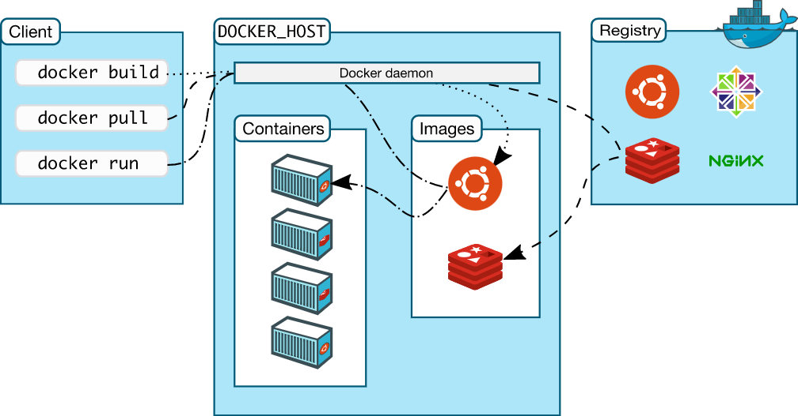

## Introduction

Docker is an open platform for developing, shipping, and running applications. Docker enables us to separate our applications from our infrastructure so we can deliver software quickly. With Docker, we can manage our infrastructure in the same ways we manage our applications. By taking advantage of Docker’s methodologies for shipping, testing, and deploying code quickly, we can significantly reduce the delay between writing code and running it in production. Docker makes it really easy to install and run software without worrying about setup or dependencies. 

Docker provides the ability to package and run an application in a loosely isolated environment called a container. The isolation and security allows us to run many containers simultaneously on a given host. Containers are lightweight and contain everything needed to run the application, so we do not need to rely on what is currently installed on the host. We can easily share containers while we work, and be sure that everyone you share with gets the same container that works in the same way.

Docker provides tooling and a platform to manage the lifecycle of our containers:
- Develop our application and its supporting components using containers.
- The container becomes the unit for distributing and testing your application.
- When we’re ready, deploy our application into your production environment, as a container or an orchestrated service. This works the same whether your production environment is a local data center, a cloud provider, or a hybrid of the two.

Docker uses a client-server architecture. The Docker client talks to the Docker daemon, which does the heavy lifting of building, running, and distributing our Docker containers. The Docker client and daemon can run on the same system, or we can connect a Docker client to a remote Docker daemon. The Docker client and daemon communicate using a REST API, over UNIX sockets or a network interface. Another Docker client is Docker Compose, that lets us work with applications consisting of a set of containers. The Docker daemon (dockerd) listens for Docker API requests and manages Docker objects such as images, containers, networks, and volumes. A daemon can also communicate with other daemons to manage Docker services.



Docker uses a technology called namespaces to provide the isolated workspace called the container. When you run a container, Docker creates a set of namespaces for that container. The process of segmenting part of a resource based on the process requesting the resource is called namespacing. These namespaces provide a layer of isolation. Each aspect of a container runs in a separate namespace and its access is limited to that namespace. Linux namespaces provide isolation for running processes, limiting their access to system resources without the running process being aware of the limitations. Namespaces are a feature of the Linux kernel that partitions kernel resources such that one set of processes sees one set of resources while another set of processes sees a different set of resources. A control group (cgroup) is a Linux kernel feature that limits, accounts for, and isolates the resource usage (CPU, memory, disk I/O, network, and so on) of a collection of processes. We can use cgroups to control how much of a given key resource (CPU, memory, network, and disk I/O) can be accessed or used by a process or set of processes. Cgroups are a key component of containers because there are often multiple processes running in a container that you need to control together. Namespaces provide isolation of system resources, and cgroups allow for fine‑grained control and enforcement of limits for those resources. 


## Images

An image is a read-only template with instructions for creating a Docker container. Often, an image is based on another image, with some additional customization. For example, we may build an image which is based on the ubuntu image, but installs the Apache web server and our application, as well as the configuration details needed to make our application run.

We can create our own images or we can only use those created by others and published in a registry. To build our own image, we create a Dockerfile with a simple syntax for defining the steps needed to create the image and run it. Each instruction in a Dockerfile creates a layer in the image. When we change the Dockerfile and rebuild the image, only those layers which have changed are rebuilt. This is part of what makes images so lightweight, small, and fast, when compared to other virtualization technologies.

Docker can build images automatically by reading the instructions from a Dockerfile. A Dockerfile is a text document that contains all the commands a user could call on the command line to assemble an image, which defines how a container should behave. Using `docker build` users can create an automated build that executes several command-line instructions in succession. To create a Dockerfile, we specify a base image, run some commands to install additional commands if needed, and then specify a command to run on container startup

## Containers

A container is a runnable instance of an image. We can create, start, stop, move, or delete a container using the Docker API or CLI. We can connect a container to one or more networks, attach storage to it, or even create a new image based on its current state.

By default, a container is relatively well isolated from other containers and its host machine. We can control how isolated a container’s network, storage, or other underlying subsystems are from other containers or from the host machine.

A container is defined by its image as well as any configuration options you provide to it when you create or start it. When a container is removed, any changes to its state that are not stored in persistent storage disappear.

## Volumes

Volumes are the preferred mechanism for persisting data generated by and used by Docker containers. Volumes work on both Linux and Windows containers and can be safely shared among multiple containers. Volume drivers let us store volumes on remote hosts or cloud providers, to encrypt the contents of volumes, or to add other functionality. In addition, volumes are often a better choice than persisting data in a container’s writable layer, because a volume doesn’t increase the size of the containers using it, and the volume’s contents exist outside the lifecycle of a given container. They help us set up a reference to the data present in local machine.    


Volumes can be attached for `docker run` command with `-v` flag. Example: `docker run -p 3000:3000 -v /app/node_modules -v $(pwd):/app <image-id>`. In this command, the first `-v` flag ensures that the directory specified is just a placeholder for the container without mapping it to anything. The second `-v` flag sets up / mounts a volume for the present working directory and maps it to `/app` folder within the container. If colon (:) isn't used during docker volume mapping, then it essentially means that no mapping should be performed for the argument.         


## Docker CLI commands

- `docker version` - prints out the docker client and server versions
- `docker build -t <image-tag> .` - builds an image from a Dockerfile, and applies the tag specified to the image. The `latest` tag is automatically specified if the version isn't present within the image tag provided in the command. The `-f` flag explicitly specifies the name of Dockerfile, rather than looking for it in the directory.
- `docker run <image-name>` - downloads the image from container registry (if not present on local system) and runs it as a container. This command creates a file system snapshot of the downloaded image and runs the default startup command associated with the image, which can be overridden by providing additional arguments to the command, syntax: `docker run <image-name> <additional-commands>`, and example: `docker run busybox echo hello there`. Also, `docker run` = `docker create` + `docker start`. To start a shell instead of running default command, use `docker run -it <image-name> sh`. Port mapping can be specified with `-p` flag (example: `-p 8000:8080`), where the first port routes incoming requests from localhost or external network, and the second port represents the port inside the container to which the application is listening.  
- `docker ps` - lists all currently running containers on the machine. Use `--all` or `-a` to list all containers, including those that aren't running
- `docker create <image-name>` - creates a container from an image i.e., creates a file system snapshot of the downloaded image
- `docker start -a <container-id>` - runs a created container. `-a` argument is attaching container stdout to terminal for printing output from container. This command can also be used to restart stopped/exited containers, but the default command assigned to the container cannot be changed during restart.
- `docker system prune` - removes all unused/stopped containers, networks, images (both dangling and unreferenced), build cache and optionally, volumes
- `docker logs <container-id>` - fetches the logs of a container by batch-retrieving logs present at the time of execution
- `docker stop <container-id>` - stops one or more running containers by sending `SIGTERM` (signal termination) signal to the main process running in the container, and then after a grace period, sending `SIGKILL` signal to it
- `docker kill <container-id>` - kills one or more running containers by sending `SIGKILL` signal to the main process running in the container
- `docker exec -it <container-id> <command>` - runs a new command in a running container, where `-it` allows us to type and provide inputs directly into the container: `-i` attaches our terminal to the `STDIN` of the new command's running process, and `-t` allocates a pseudo TTY to display typed input (associated with process) in terminal. Use `sh` command to gain access to container shell (command processor) and enter commands directly inside it. Example: `docker exec -it 4e3d15293585 sh`. Use `CTRL+D` or `exit` to exit the shell.
- `docker tag SOURCE_IMAGE[:TAG] TARGET_IMAGE[:TAG]` - creates a tag named `TARGET_IMAGE` that refers to `SOURCE_IMAGE`. A full image name has the following format: `[HOST[:PORT_NUMBER]/]PATH`. Alternative format would be: `<your-docker-id>/<repo-or-project-name>`:`<version`.
- `docker commit <container-id>` - creates a new image from a container's changes. Docker creates containers for every build step, and uses the image generated in these steps for the next subsequent step. It is possible to use a running container to create a build image. To save an image out of a running container, use `docker commit -c <cmd> <container-id>`. Example: `docker commit -c 'CMD ["node", "server.js"]' 288hdjeh738`
- `docker volume create <volume-name>` - Creates a new volume that containers can consume and store data in. If a name is not specified, Docker generates a random name.
- `docker volume inspect <volume-name>` - Returns information about one or more volumes. By default, this command renders all results in a JSON array. We can specify an alternate format to execute a given template for each result. 
- `docker volume ls` - List all the volumes known to Docker. We can filter using the `-f` or `--filter` flag.
- `docker volume rm <volume-name` - Remove one or more volumes. We cannot remove a volume that is in use by a container.
- `docker attach <container-id-or-name>` - attaches our terminal’s standard input, output, and error (or any combination of the three) to a running container using the container’s ID or name. This allows us to view its ongoing output or to control it interactively, as though the commands were running directly in our terminal. We can attach to the same contained process multiple times simultaneously, from different sessions on the Docker host. `docker attach` always attaches to the stdin of the primary process of the container (having PID 1), even if there are multiple processes running inside it.

## Dockerfile

Docker can build images automatically by reading the instructions from a Dockerfile. A Dockerfile is a text document that contains all the commands a user could call on the command line to assemble an image. Docker runs instructions in a Dockerfile in order. A Dockerfile must begin with a `FROM` instruction. This may be after parser directives, comments, and globally scoped ARGs. The `FROM` instruction specifies the Parent Image from which we are building. `FROM` may only be preceded by one or more `ARG` instructions, which declare arguments that are used in `FROM` lines in the Dockerfile. Format of Dockerfile:
```
# Comment
INSTRUCTION arguments
```
Before the docker CLI sends the context to the docker daemon, it looks for a file named `.dockerignore` in the root directory of the context. If this file exists, the CLI modifies the context to exclude files and directories that match patterns in it. This helps to avoid unnecessarily sending large or sensitive files and directories to the daemon and potentially adding them to images using ADD or COPY.

### Copy command syntax in Dockerfile        

`COPY ./ ./` copies everything from current working directory to the container's root folder. Here the first parameter represents the path to folder which needs to be copied from local environment, relative to build context; and the second parameter represents the place to which it will be copied to, inside the container.

## Docker Compose

Compose is a tool for defining and running multi-container Docker applications. With Compose, we use a YAML file to configure our application’s services. Then, with a single command, we create and start all the services from our configuration. Compose works in all environments: production, staging, development, testing, as well as CI workflows. It also has commands for managing the whole lifecycle of our application.       

The key features of Compose that make it effective are:

- Have multiple isolated environments on a single host
- Preserves volume data when containers are created
- Only recreate containers that have changed
- Supports variables and moving a composition between environments

## Docker Compose commands

- `docker-compose up --build` - rebuilds containers before running them. Builds, (re)creates, starts, and attaches to containers for a service. Unless they are already running, this command also starts any linked services. The `-d` flag runs the containers in the background (detached mode).
- `docker-compose down` - Stops containers and removes containers, networks, volumes, and images created by `docker-compose up`. By default, the only things removed are: containers for services defined in the Compose file, networks defined in the networks section of the Compose file, the default network, if one is used. Networks and volumes defined as external are never removed. Anonymous volumes are not removed by default.
- `docker-compose ps` - Similar to `docker ps`, it provides the status of containers running for a Docker Compose file. It lists containers for a Compose project, with current status and exposed ports. By default, only running containers are shown. `--all` flag can be used to include stopped containers.


## `docker-compose.yml` file

The Compose file is a YAML file defining services, networks, and volumes for a Docker application. The Compose specification allows one to define a platform-agnostic container based application. Such an application is designed as a set of containers which have to both run together with adequate shared resources and communication channels.       

Computing components of an application are defined as **Services**. A **Service** is an abstract concept implemented on platforms by running the same container image (and configuration) one or more times. Services communicate with each other through **Networks**. In this specification, a **Network** is a platform capability abstraction to establish an IP route between containers within services connected together. Low-level, platform-specific networking options are grouped into the Network definition and MAY be partially implemented on some platforms.          

Services store and share persistent data into **Volumes**. The specification describes such a persistent data as a high-level filesystem mount with global options. Actual platform-specific implementation details are grouped into the Volumes definition and MAY be partially implemented on some platforms.         

Some services require configuration data that is dependent on the runtime or platform. For this, the specification defines a dedicated concept: **Configs**. From a Service container point of view, Configs are comparable to Volumes, in that they are files mounted into the container. But the actual definition involves distinct platform resources and services, which are abstracted by this type.          

A **Secret** is a specific flavor of configuration data for sensitive data that SHOULD NOT be exposed without security considerations. **Secrets** are made available to services as files mounted into their containers, but the platform-specific resources to provide sensitive data are specific enough to deserve a distinct concept and definition within the Compose specification. Distinction within Volumes, Configs and Secret allows implementations to offer a comparable abstraction at service level, but cover the specific configuration of adequate platform resources for well identified data usages.          

Within the `docker-compose.yml` file, the build context specifies the data with which the image needs to be built. The current working directory is specified like this:
```
    build:
        context: .
```         
There are 2 ways of providing environment variables to Docker Compose: specifying both name and value in `variableName=value` format, and specifying only `variableName`, where the value is taken from local machine at runtime.          

Docker provides restart policies to control whether our containers start automatically when they exit, or when Docker restarts. Restart policies ensure that linked containers are started in the correct order. A restart policy only takes effect after a container starts successfully. In this case, starting successfully means that the container is up for at least 10 seconds and Docker has started monitoring it. This prevents a container which does not start at all from going into a restart loop. There are 4 different restart policies for crashed containers in Docker Compose:
1. `"no"` - never attempt to restart the container if it stops or crashes. This policy is always mentioned in quotes, as YAML files interpret no for `false`
2. `always` - if the container stops for any reason, always attempt to restart it
3. `on-failure` - only restart if the container stops with an error code
4. `unless-stopped` - always restart unless we forcibly stop it

## Credits & Attributions

- [Official Docker Documentation](https://docs.docker.com/get-started/overview/)
- [Docker and Kubernetes: The Complete Guide](https://www.udemy.com/course/docker-and-kubernetes-the-complete-guide/) by Stephen Grider
