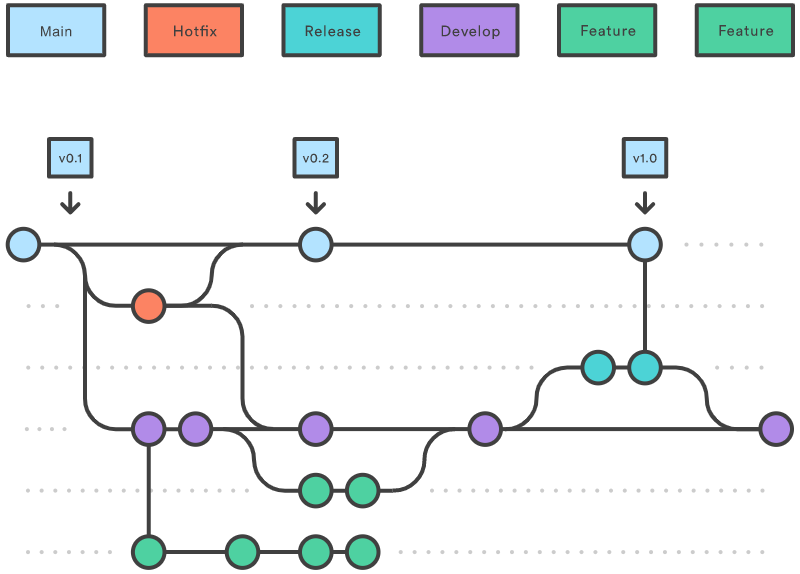
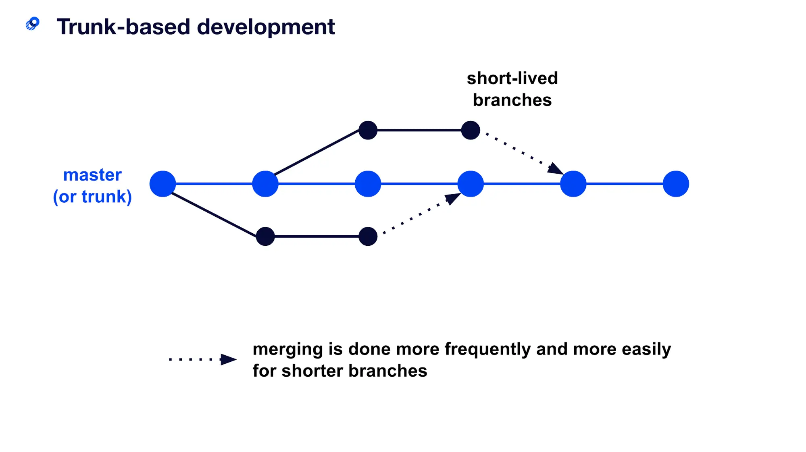

> This post is under work in progress, and hence, isn't complete yet.

## Introduction

Branches are primarily used as a means for teams to develop features giving them a separate workspace for their code. These branches are usually merged back to a master branch upon completion of work. In this way, features (and any bug and bug fixes) are kept apart from each other allowing you to fix mistakes more easily.

This means that branches protect the mainline of code and any changes made to any given branch don’t affect other developers.

A branching strategy, therefore, is the strategy that software development teams adopt when writing, merging and deploying code when using a version control system. It refers to the strategy a software development team employs when writing, merging, and shipping code in the context of a version control system like Git.

It is essentially a set of rules that developers can follow to stipulate how they interact with a shared codebase. A branching strategy ensures everyone on the team is following the same process for making changes to source control. The right strategy enhances collaboration, efficiency, and accuracy in the software delivery process, while the wrong strategy (or no strategy) leads to hours of lost effort.

---

## Centralized Workflow

The Centralized Workflow is a great Git workflow for teams transitioning from SVN. Like Subversion, the Centralized Workflow uses a central repository to serve as the single point-of-entry for all changes to the project. Instead of trunk, the default development branch is called main and all changes are committed into this branch. This workflow doesn’t require any other branches besides main.

The Centralized Workflow is similar to other workflows in its utilization of a remote server-side hosted repository that developers push and pull form. Compared to other workflows, the Centralized Workflow has no defined pull request or forking patterns. A Centralized Workflow is generally better suited for teams migrating from SVN to Git and smaller size teams.

In centralized systems, there is generally a single collaboration model–the centralized workflow. One central hub, or repository, can accept code, and everyone synchronizes their work to it. A number of developers are nodes – consumers of that hub – and synchronize to that one place.

### How it works

Developers start by cloning the central repository. In their own local copies of the project, they edit files and commit changes as they would with SVN; however, these new commits are stored locally - they’re completely isolated from the central repository. This lets developers defer synchronizing upstream until they’re at a convenient break point.

To publish changes to the official project, developers "push" their local main branch to the central repository. This is the equivalent of svn commit, except that it adds all of the local commits that aren’t already in the central main branch. Central repositories should always be bare repositories (they shouldn’t have a working directory).

The central repository represents the official project, so its commit history should be treated as sacred and immutable. If a developer’s local commits diverge from the central repository, Git will refuse to push their changes because this would overwrite official commits.

This means that if two developers clone from the hub and both make changes, the first developer to push their changes back up can do so with no problems. The second developer must merge in the first one’s work before pushing changes up, so as not to overwrite the first developer’s changes. This concept is as true in Git as it is in Subversion (or any CVCS), and this model works perfectly well in Git.

If local changes directly conflict with upstream commits, Git will pause the rebasing process and give you a chance to manually resolve the conflicts. The nice thing about Git is that it uses the same git status and git add commands for both generating commits and resolving merge conflicts. This makes it easy for new developers to manage their own merges. Plus, if they get themselves into trouble, Git makes it very easy to abort the entire rebase and try again (or go find help).

---

## Feature Branch Workflow

The core idea behind the Feature Branch Workflow is that all feature development should take place in a dedicated branch instead of the main branch. This encapsulation makes it easy for multiple developers to work on a particular feature without disturbing the main codebase. It also means the main branch will never contain broken code, which is a huge advantage for continuous integration environments.

### How it works

The Feature Branch Workflow assumes a central repository, and main represents the official project history. Instead of committing directly on their local main branch, developers create a new branch every time they start work on a new feature. Feature branches should have descriptive names, like animated-menu-items or issue-#1061. The idea is to give a clear, highly-focused purpose to each branch. Git makes no technical distinction between the main branch and feature branches, so developers can edit, stage, and commit changes to a feature branch.

In addition, feature branches can (and should) be pushed to the central repository. This makes it possible to share a feature with other developers without touching any official code. Since main is the only “special” branch, storing several feature branches on the central repository doesn’t pose any problems. Of course, this is also a convenient way to back up everybody’s local commits. The following is a walk-through of the life-cycle of a feature branch.

### Pull requests

Aside from isolating feature development, branches make it possible to discuss changes via pull requests. Once someone completes a feature, they don’t immediately merge it into main. Instead, they push the feature branch to the central server and file a pull request asking to merge their additions into main. This gives other developers an opportunity to review the changes before they become a part of the main codebase.

---

## Forking Workflow

The Forking Workflow is fundamentally different than other popular Git workflows. Instead of using a single server-side repository to act as the “central” codebase, it gives every developer their own server-side repository. This means that each contributor has not one, but two Git repositories: a private local one and a public server-side one. The Forking Workflow is most often seen in public open source projects.

The main advantage of the Forking Workflow is that contributions can be integrated without the need for everybody to push to a single central repository. Developers push to their own server-side repositories, and only the project maintainer can push to the official repository. This allows the maintainer to accept commits from any developer without giving them write access to the official codebase.

The Forking Workflow typically follows a branching model based on the Gitflow Workflow. This means that complete feature branches will be purposed for merge into the original project maintainer's repository. The result is a distributed workflow that provides a flexible way for large, organic teams (including untrusted third-parties) to collaborate securely. This also makes it an ideal workflow for open source projects.

### How it works

As in the other Git workflows, the Forking Workflow begins with an official public repository stored on a server. But when a new developer wants to start working on the project, they do not directly clone the official repository.

Instead, they fork the official repository to create a copy of it on the server. This new copy serves as their personal public repository—no other developers are allowed to push to it, but they can pull changes from it (we’ll see why this is important in a moment). After they have created their server-side copy, the developer performs a git clone to get a copy of it onto their local machine. This serves as their private development environment, just like in the other workflows.

When they're ready to publish a local commit, they push the commit to their own public repository—not the official one. Then, they file a pull request with the main repository, which lets the project maintainer know that an update is ready to be integrated. The pull request also serves as a convenient discussion thread if there are issues with the contributed code. The following is a step-by-step example of this workflow.

1. A developer 'forks' an 'official' server-side repository. This creates their own server-side copy.
2. The new server-side copy is cloned to their local system.
3. A Git remote path for the 'official' repository is added to the local clone.
4. A new local feature branch is created.
5. The developer makes changes on the new branch.
6. New commits are created for the changes.
7. The branch gets pushed to the developer's own server-side copy.
8. The developer opens a pull request from the new branch to the 'official' repository.
9. The pull request gets approved for merge and is merged into the original server-side repository

To integrate the feature into the official codebase, the maintainer pulls the contributor’s changes into their local repository, checks to make sure it doesn’t break the project, merges it into their local main branch, then pushes the main branch to the official repository on the server. The contribution is now part of the project, and other developers should pull from the official repository to synchronize their local repositories.

---

## GitFlow

Gitflow is a Git branching model that involves the use of feature branches and multiple primary branches. It was first published and made popular by Vincent Driessen at nvie. Compared to trunk-based development, Gitflow has numerous, longer-lived branches and larger commits. Under this model, developers create a feature branch and delay merging it to the master trunk branch until the feature is complete. These long-lived feature branches require more collaboration to merge and have a higher risk of deviating from the trunk branch. They can also introduce conflicting updates.

Gitflow can be used for projects that have a scheduled release cycle and for the DevOps best practice of continuous delivery. This workflow doesn’t add any new concepts or commands beyond what’s required for the Feature Branch Workflow. Instead, it assigns very specific roles to different branches and defines how and when they should interact. In addition to feature branches, it uses individual branches for preparing, maintaining, and recording releases. Of course, you also get to leverage all the benefits of the Feature Branch Workflow: pull requests, isolated experiments, and more efficient collaboration.

This workflow consists of five types of branches, each with different roles:

- Master / Main branch
- Feature branch (aka Topic branch)
- Release branch
- Hotfix branch
- Develop branch (aka Integration branch)

### Master / Main branch

Upon making the first commit in a repository, Git will automatically create a master branch by default. Subsequent commits will go under the master branch until you decide to create and switch over to another branch. The master branch stores the official release history. Other developers should now clone the central repository and create a tracking branch for develop.

Codebase residing in the master branch is considered to be production-ready. When it is ready for a specific release, the latest commit will be given a release tag.

### Feature/Topic branch

When you start working on a new feature/bug fix, you should create a feature/topic branch. A feature/topic branch is normally created off a develop/integration branch. This feature/topic branch can reside in your local machine throughout the entire development lifecycle of the feature.

You will push this branch to the remote repository whenever you are ready to merge the change set with the develop/integration branch. When a feature is complete, it gets merged back into develop. Features should never interact directly with master. Feature branches are generally created off to the latest develop branch.

### Release branch

When you roll out a new release, you create a release branch. A release branch helps you to ensure that the new features are running correctly.

By convention, release branch names normally start with the prefix “release-“.

The release branch is typically created off the develop/integration branch when it’s close to being production-ready.

Creating this branch starts the next release cycle, so no new features can be added after this point—only bug fixes, documentation generation, and other release-oriented tasks should go in this branch. Having this branch will allow other team members to continue pushing new features to the develop/integration branch without interrupting the release workflow.

When you are ready to release, merge the release branch with the master branch and tag a release number to the newly created merge commit.

You should also merge the release branch with the develop/integration branch so that both the master and develop/integration branches receive the latest changes/bug fixes from the release branch.

Using a dedicated branch to prepare releases makes it possible for one team to polish the current release while another team continues working on features for the next release. It also creates well-defined phases of development (e.g., it's easy to say, “This week we're preparing for version 4.0,” and to actually see it in the structure of the repository). Once the release is ready to ship, it will get merged it into master and develop, then the release branch will be deleted. It’s important to merge back into develop because critical updates may have been added to the release branch and they need to be accessible to new features. If your organization stresses code review, this would be an ideal place for a pull request.

### Hotfix branch

When you need to add an important fix to your production codebase quickly, you can create a Hotfix branch off the master branch.

By convention, hotfix branch names normally start with the prefix “hotfix-“.

The advantage of a hotfix branch is that it allows you to quickly issue a patch and have the change merged with the master branch without having to wait for the next release.

A hotfix branch should be merged with the develop/integration branch as well. Having a dedicated line of development for bug fixes lets your team address issues without interrupting the rest of the workflow or waiting for the next release cycle. You can think of maintenance branches as ad hoc release branches that work directly with master.

### Develop/Integration branch

A develop/integration branch should be kept stable at all times. This is important because new branches are created off of this branch, and this branch could eventually go out live on production. Continuous integration tools such as Jenkins can be used to help do just that.

When some changes need to be merged into the develop/integration branch, it is generally a good idea to create a feature/topic branch to work on independently.

### Problems with the Git flow

Git flow was one of the first proposals to use Git branches, and it has received a lot of attention. It suggests a main branch and a separate develop branch, with supporting branches for features, releases, and hotfixes. The development happens on the develop branch, moves to a release branch, and is finally merged into the main branch.

Git flow is a well-defined standard, but its complexity introduces two problems. The first problem is that developers must use the develop branch and not main. main is reserved for code that is released to production. It is a convention to call your default branch main and to mostly branch from and merge to this. Because most tools automatically use the main branch as the default, it is annoying to have to switch to another branch.

The second problem of Git flow is the complexity introduced by the hotfix and release branches. These branches can be a good idea for some organizations but are overkill for the vast majority of them. Nowadays, most organizations practice continuous delivery, which means that your default branch can be deployed. Continuous delivery removes the need for hotfix and release branches, including all the ceremony they introduce. An example of this ceremony is the merging back of release branches. Though specialized tools do exist to solve this, they require documentation and add complexity. Frequently, developers make mistakes such as merging changes only into main and not into the develop branch. The reason for these errors is that Git flow is too complicated for most use cases. For example, many projects do releases but don’t need to do hotfixes.

---

## GitHub Flow

1. Anything in the master branch is deployable
2. To work on something new, create a descriptively named branch off of master (ie: `new-oauth2-scopes`)
3. Commit to that branch locally and regularly push your work to the same named branch on the server
4. When you need feedback or help, or you think the branch is ready for merging, open a pull request
5. After someone else has reviewed and signed off on the feature, you can merge it into master
6. Once it is merged and pushed to ‘master’, you can and should deploy immediately

### #1 - anything in the master branch is deployable

This is basically the only hard rule of the system. There is only one branch that has any specific and consistent meaning and we named it master. To us, this means that it has been deployed or at the worst will be deployed within hours. It's incredibly rare that this gets rewound (the branch is moved back to an older commit to revert work) - if there is an issue, commits will be reverted or new commits will be introduced that fixes the issue, but the branch itself is almost never rolled back.

The master branch is stable and it is always, always safe to deploy from it or create new branches off of it. If you push something to master that is not tested or breaks the build, you break the social contract of the development team and you normally feel pretty bad about it. Every branch we push has tests run on it and reported into the chat room, so if you haven't run them locally, you can simply push to a topic branch (even a branch with a single commit) on the server and wait for Jenkins to tell you if it passes everything.

You could have a deployed branch that is updated only when you deploy, but we don't do that. We simply expose the currently deployed SHA through the webapp itself and curl it if we need a comparison made.

### #2 - create descriptive branches off of master

When you want to start work on anything, you create a descriptively named branch off of the stable master branch. Some examples in the GitHub codebase right now would be user-content-cache-key, submodules-init-task or redis2-transition. This has several advantages - one is that when you fetch, you can see the topics that everyone else has been working on. Another is that if you abandon a branch for a while and go back to it later, it's fairly easy to remember what it was.

This is nice because when we go to the GitHub branch list page we can easily see what branches have been worked on recently and roughly how much work they have on them.

### #3 - push to named branches constantly

Another big difference from git-flow is that we push to named branches on the server constantly. Since the only thing we really have to worry about is master from a deployment standpoint, pushing to the server doesn't mess anyone up or confuse things - everything that is not master is simply something being worked on.

It also make sure that our work is always backed up in case of laptop loss or hard drive failure. More importantly, it puts everyone in constant communication. A simple 'git fetch' will basically give you a TODO list of what every is currently working on.

It also lets everyone see, by looking at the GitHub Branch List page, what everyone else is working on so they can inspect them and see if they want to help with something.

### #4 - open a pull request at any time

GitHub has an amazing code review system called `Pull Requests`. Many people use it for open source work - fork a project, update the project, send a pull request to the maintainer. However, it can also easily be used as an internal code review system, which is what we do.

Actually, we use it more as a branch conversation view more than a pull request. You can send pull requests from one branch to another in a single project (public or private) in GitHub, so you can use them to say "I need help or review on this" in addition to "Please merge this in".

This is cool because the Pull Request feature let's you comment on individual lines in the unified diff, on single commits or on the pull request itself and pulls everything inline to a single conversation view. It also let you continue to push to the branch, so if someone comments that you forgot to do something or there is a bug in the code, you can fix it and push to the branch, GitHub will show the new commits in the conversation view and you can keep iterating on a branch like that.

If the branch has been open for too long and you feel it's getting out of sync with the master branch, you can merge master into your topic branch and keep going. You can easily see in the pull request discussion or commit list when the branch was last brought up to date with the 'master'.

When everything is really and truly done on the branch and you feel it's ready to deploy, you can move on to the next step.

### #5 - merge only after pull request review

We don’t simply do work directly on master or work on a topic branch and merge it in when we think it’s done - we try to get signoff from someone else in the company. This is generally a +1 or emoji or “:shipit:” comment, but we try to get someone else to look at it.

Once we get that, and the branch passes CI, we can merge it into master for deployment, which will automatically close the Pull Request when we push it.

### #6 - deploy immediately after review

Finally, your work is done and merged into the master branch. This means that even if you don’t deploy it now, people will base new work off of it and the next deploy, which will likely happen in a few hours, will push it out. So since you really don’t want someone else to push something that you wrote that breaks things, people tend to make sure that it really is stable when it’s merged and people also tend to push their own changes.

---

## Trunk-based Development

Trunk-based development (TBD) is a branching strategy where all developers integrate their changes directly to a shared trunk every day, a shared trunk that is always in a releasable state. No matter what a developer might do on their local repository, at least once each day, they must integrate their code. This practice forces each developer to regularly see and react to the changes being made by their teammates in version control, which drives collaboration around the quality and state of the codebase as a near-constant activity.

TBD allows for the use of other branches, such as a short-lived release branch off the trunk for executing a release and local-only feature branches, but neither are required to practice TBD. As Continuous Delivery and DevOps have become increasingly prominent and even necessary for many software development teams, TBD has the tightest alignment with those modern delivery approaches. In fact, trunk-based development is a prerequisite for CI/CD.

A trunk-based development flow is much simpler. There are only two primary sources of branches:

- **The trunk branch** (hence the name of the branching strategy). This is the branch that’s deployed to any integration environments—the branch that’s deployed to production, the one that’s deployed to user acceptance environments.
- **Feature branches** for new work or bug fixes. These branches are just like the feature-branch development branches. This is where developers make changes. When they’re done, they create a pull request to the trunk branch.

### Benefits of trunk-based development

Trunk-based development is a required practice for continuous integration. If build and test processes are automated but developers work on isolated, lengthy feature branches that are infrequently integrated into a shared branch, continuous integration is not living up to its potential.

Trunk-based development eases the friction of code integration. When developers finish new work, they must merge the new code into the main branch. Yet they should not merge changes to the truck until they have verified that they can build successfully. During this phase, conflicts may arise if modifications have been made since the new work began. In particular, these conflicts are increasingly complex as development teams grow and the code base scales. This happens when developers create separate branches that deviate from the source branch and other developers are simultaneously merging overlapping code. Luckily, the trunk-based development model reduces these conflicts.

#### Allows continuous code integration

In the trunk-based development model, there is a repository with a steady stream of commits flowing into the main branch. Adding an automated test suite and code coverage monitoring for this stream of commits enables continuous integration. When new code is merged into the trunk, automated integration and code coverage tests run to validate the code quality.

#### Ensures continuous code review

The rapid, small commits of trunk-based development make code review a more efficient process. With small branches, developers can quickly see and review small changes. This is far easier compared to a long-lived feature branch where a reviewer reads pages of code or manually inspects a large surface area of code changes.

#### Enables consecutive production code releases

Teams should make frequent, daily merges to the main branch. Trunk-based development strives to keep the trunk branch “green”, meaning it's ready to deploy at any commit. Automated tests, code converge, and code reviews provides a trunk-based development project with the assurances it’s ready to deploy to production at any time. This gives team agility to frequently deploy to production and set further goals of daily production releases.

#### Trunk-based development and CI/CD

As CI/CD grew in popularity, branching models were refined and optimized, leading to the rise of trunk-based development. Now, trunk-based development is a requirement of continuous integration. With continuous integration, developers perform trunk-based development in conjunction with automated tests that run after each committee to a trunk. This ensures the project works at all times.

## Credits and Attributions

- [Branching Patterns](https://martinfowler.com/articles/branching-patterns.html)
- [Nyx Guide](https://mooltiverse.github.io/nyx/guide/user/best-practice/branching-models/)
- [GitFlow](https://nvie.com/posts/a-successful-git-branching-model/)
- [GitHub Flow](http://scottchacon.com/2011/08/31/github-flow.html)
