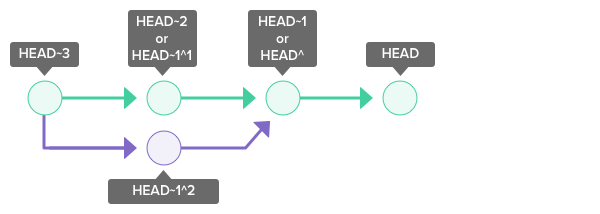
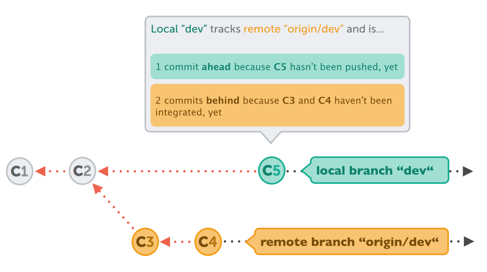
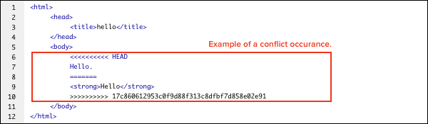
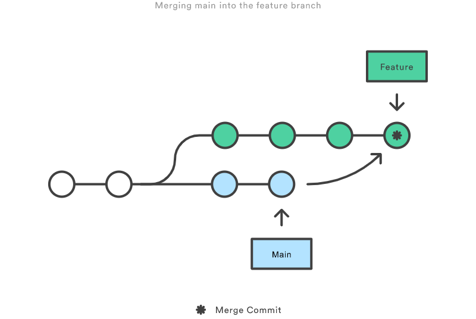
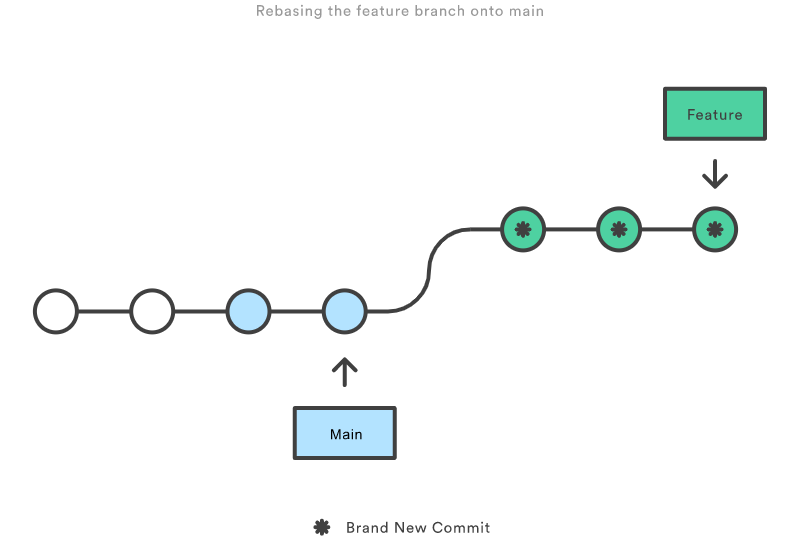
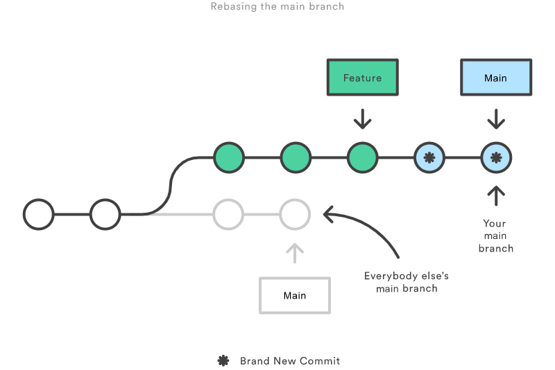

> This post is under work in progress, and hence, isn't complete yet.

## Introduction

Git is a distributed version control and source code management system, originally created by Linus Torvalds in 2005. Unlike older centralized version control systems such as SVN and CVS, Git is distributed: every developer has the full history of their code repository locally. This makes the initial clone of the repository slower, but subsequent operations such as commit, blame, diff, merge, and log dramatically faster.

It does this through a series of snapshots of your project, and it works with those snapshots to provide you with functionality to version and manage your source code.

## Versioning Concepts

Version control is a system that records changes to a file(s), over time. As you modify files, the version control system records and saves each change. This allows you to restore a previous version of your code at any time.

### Centralized Versioning vs. Distributed Versioning

- Centralized version control focuses on synchronizing, tracking, and backing up files.
- Distributed version control focuses on sharing changes. Every change has a unique id.
- Distributed systems have no defined structure. You could easily have a SVN style, centralized system, with git.

## Git Architecture

**Repository** - A set of files, directories, historical records, commits, and heads. Imagine it as a source code data structure, with the attribute that each source code “element” gives you access to its revision history, among other things. It holds all of the commits — a snapshot of all your files at a point in time — that have been made. You can access the commit history with the Git log

A git repository is comprised of the .git directory & working tree.

- **.git Directory (component of repository)** - The .git directory contains all the configurations, logs, branches, HEAD, and more. Detailed List.
- **Working Tree (component of repository)** -This is basically the directories and files in your repository. It is often referred to as your working directory.

**Index (component of .git dir)** - The Index is the staging area in git. It’s basically a layer that separates your working tree from the Git repository. This gives developers more power over what gets sent to the Git repository. The index compares the files in the working tree to the files in the repo. When you make a change in the working tree, the index marks the file as modified before it is committed.

**Commit** - A git commit is a snapshot of a set of changes, or manipulations to your Working Tree. For example, if you added 5 files, and removed 2 others, these changes will be contained in a commit (or snapshot). This commit can then be pushed to other repositories, or not!

**Branch** - A branch is essentially a pointer to the last commit you made. As you go on committing, this pointer will automatically update to point to the latest commit.

**Tag** - A tag is a mark on specific point in history. Typically people use this functionality to mark release points (v1.0, and so on).

**HEAD and head (component of .git dir)** - HEAD is a pointer that points to the current branch. A repository only has 1 active HEAD. head is a pointer that points to any commit. A repository can have any number of heads.

HEAD branch is the currently 'active' or 'checked out' branch. There can only be one active branch at a time, that is HEAD branch. 99% of the time, 'working' with branches means local branches, of local repository. Remote branches are mainly for synchronizing. Bulk of the actual work happens in local branches.

There are two types of Git repositories: remote and local.

- A remote repository is hosted on a remote, or off-site, server that is shared among multiple team members.
- A local repository is hosted on a local machine for an individual user.

### Stages of Git

1. **Modified** - Changes have been made to a file but file has not been committed to Git Database yet
2. **Staged** - Marks a modified file to go into your next commit snapshot
3. **Committed** - Files have been committed to the Git Database

The working tree is where you make changes. There you can edit files, add new files, and remove files that are no longer needed.

Once a file has been changed in the working tree, it is noted as modified in the index (e.g., the staging area where new commits are prepared) where it sits between the repository and the working tree.

Changes made in the working tree are not saved directly to the repository. All changes are first staged in the index and then saved in the repo. Only the files in the index are committed to the repo.


## Git commands

### Basic Git Operations

1. `git init` - Creates an empty Git repository. The Git repository’s settings, stored information, and more is stored in a directory (a folder) named “.git”.

   `git init <directory>` creates empty git repo in specified directory. Run with no arguments to initialize the current directory as a git repository

2. `git help` - To give you quick access to an extremely detailed guide of each command. Or to just give you a quick reminder of some semantics.
3. `git clone <repo>` - clone repo located at `<repo>` onto local machine. Original repo can be located on the local filesystem or on a remote machine via HTTP or SSH. By default, git clone will automatically set up a local master branch that tracks the remote master branch it was cloned from.
4. `git branch <new-branch-name>` - creates a new branch based on your current HEAD branch. Git will assume that new branch will be started based on the current checked out revision. To create a new branch on a different past revision, use `git branch <new-branch-name> <previous/past commit hash>` (8-letter commit).

   For new branch, git will include all past commits and files by default. For branch started on specific commit, git will include commits and files from that commit, inclusive. Creating new branches happens only in local repository. Creating branches in remote repository happens by publishing existing local branch.

5. `git checkout <other-branch>` - switches to a different branch. The current / checked-out branch defines the context of work that is in at the moment. It is where new commits will be created, in that context. It updates all files in the working tree to match the version in the index, or specified tree.

   ```bash
   # Checkout a repo - defaults to master branch
   $ git checkout

   # Checkout a specified branch
   $ git checkout branchName

   # Create a new branch & switch to it
   # equivalent to "git branch <name>; git checkout <name>"
   $ git checkout -b newBranch
   ```

6. `git switch <other-branch>` - switches to a different branch. This differs from the `checkout` command.
7. `git branch -m <new-name>` - renames the current HEAD branch. To rename a different branch (not the current / checked-out branch), use:

   ```bash
   $ git branch -m <old-branch-name> <new-name>
   $ git branch # simply lists out all branches in a repository
   ```

   Git doesn't allow to rename remote branches usually. Renaming a remote branch involves deleting the old one and then pushing up and publishing the new one from local repository.
   First, delete the current / old branch. Then, simply push the new local branch with the correct name.

   ```bash
   $ git push origin --delete <old-branch-name>
   $ git push -u origin <new-name>
   ```

8. `git push -u origin <local-branch>` - 'uploads' a new branch for the first time. It is not possible to create a new branch on a remote repository, but we can publish an existing local branch on a remote repository, so we can upload what we have locally to the remote server. '-u' flag is used to establish a tracking connection, which eases pushing and pulling later.

   ```bash
   # list existing branches & remotes
   $ git branch -a

   # create a new branch
   $ git branch myNewBranch

   # delete a branch
   $ git branch -d myBranch

   # rename a branch
   # git branch -m <oldname> <newname>
   $ git branch -m myBranchName myNewBranchName

   # edit a branch's description
   $ git branch myBranchName --edit-description
   ```

9. `git revert <commit>` - create a new commit that undoes all of the changes made in `<commit>`, then apply it to the current branch. Revert can be used to undo a commit. It should not be confused with reset which restores the state of a project to a previous point. Revert will add a new commit which is the inverse of the specified commit, thus reverting it.
10. `git add <directory>` - stage all changes in `<directory>` for the next commit. Replace `<directory>` with a `<file>` to change a specific file. It adds files to the staging / index. This only adds a file to the staging area / index, it doesn’t commit it to the working directory / repo.

    ```bash
    # add a file in your current working directory
    $ git add HelloWorld.java

    # add a file in a nested dir
    $ git add /path/to/file/HelloWorld.c

    # Regular Expression support!
    $ git add ./*.java

    # You can also add everything in your working directory to the staging area.
    $ git add -A

    ```

11. `git commit --amend` - replace the last commit with the staged changes and last commit combined. Use with nothing staged to edit the last commit's message
12. `git commit` - stores the current contents of the index in a new “commit.” This commit contains the changes made and a message created by the user.

    ```bash
    # commit with a message
    $ git commit -m "Added multiplyNumbers() function to HelloWorld.c"

    # signed commit with a message (user.signingkey must have been set
    # with your GPG key e.g. git config --global user.signingkey 5173AAD5)
    $ git commit -S -m "signed commit message"

    # automatically stage modified or deleted files, except new files, and then commit
    $ git commit -a -m "Modified foo.php and removed bar.php"

    # change last commit (this deletes previous commit with a fresh commit)
    $ git commit --amend -m "Correct message"
    ```

### Git HEAD

HEAD is used to represent the current snapshot of a branch. For a new repository, Git will by default point HEAD to the master branch. Changing where HEAD is pointing will update your current active branch.

> The ~(tilde) and ^(caret) symbols are used to point to a position relative to a specific commit. The symbols are used together with a commit reference, typically HEAD or a commit hash.

`~` refers to the the grandparent. `HEAD~1` refers to the commit’s first parent. `HEAD~2` refers to the first parent of the commit’s first parent.

`^` refers to the the the parent. `HEAD^1` refers to the commit’s first parent. `HEAD^2` refers to the commit’s second parent. A commit can have two parents in a merge commit.



### Tracking Branches - connecting branches with each other

Local and remote branches are stored and managed as independent objects in Git, but they have some relationship in real-life. A local branch can typically track a remote branch. Example:



In this case, local branch `develop` tracks remote branch 'origin/develop` and

- it is 1 commit **ahead** because c5 hasn't been pushed yet
- it is 2 commits **behind** because c2 + c4 haven't been integrated, yet

Tracking connection can fill in the blanks because it knows the remote branch from where push / pull needs to be done. There are 2 ways to setup tracking:

- `git branch --track <local-branch-name> <origin/remote-branch-name>` - used to setup tracking from corresponding remote branch to local branch. If such local branch doesn't exist, it will be created.
- `git checkout --track <origin/remote-branch-name>` - this downloads remote branch, and switches to it. Example: `git checkout --track origin/develop` - downloads develop branch and sets up tracking to it.

### Pulling and Pushing Branches - Synchronizing your local + remote branches

- `git pull` - download new commits from remote. Pulls from a repository and merges it with another branch. When the pull is executed, the latest revision history will download from the remote repository and import to your local repository. However, if there are changes in the local master branch that are not present in the remote origin/master branch, the git pull command will execute a merge and create a merge commit that ties those changes together. When a pull is executed, a merge commit will be automatically created in the local repository. If there is a conflict, you will have to resolve the conflict and commit the merge manually.
- `git push` - uploading new changes to remote. Push and merge changes from a branch to a remote & branch. This will cause the remote repository to update and synchronize with your local repository.
- `git branch -v` - get all update info from a branch (what's changed, both on local and remote). **ahead** - new local commits, **behind** - new remote commits

```bash
# Update your local repo, by merging in new changes
# from the remote "origin" and "master" branch.
# git pull <remote> <branch>
$ git pull origin master

# By default, git pull will update your current branch
# by merging in new changes from its remote-tracking branch
$ git pull

# Merge in changes from remote branch and rebase
# branch commits onto your local repo, like: "git fetch <remote> <branch>, git
# rebase <remote>/<branch>"
$ git pull origin master --rebase

# Push and merge changes from a local repo to a
# remote named "origin" and "master" branch.
# git push <remote> <branch>
$ git push origin master

# By default, git push will push and merge changes from
# the current branch to its remote-tracking branch
$ git push

# To link up current local branch with a remote branch, add -u flag:
$ git push -u origin master
# Now, anytime you want to push from that same local branch, use shortcut:
$ git push
```

### Deleting Branches - deleting a branch in your local repository

- `git branch -d <branch-name>` - It is not possible to delete the current HEAD branch, as it is active. So, switch to another branch, and delete the desired one. Git will warn user, if you're deleting a branch that has specific new commits compared to rest of the branches. In such case, `-f` option is necessary to delete
- `git push origin --delete <remote-branch-name>` - Used to delete remote branch. While deleting a branch, keep in mind to check if you should delete its counterpart branch to write the tracking branch

### Merging Branches - integrating changes from another branch into your current local HEAD branch

It is essentially bringing new commits from another branch into your current HEAD branch. It needs 2 steps: First, check out the branch that should receive the changes. Then, execute the `merge` command with the name of branch that contains the desired changes

- `git switch main` -> `git switch <receiving-branch>`
- `git merge feature/uploader` -> `git merge <merging-branch-name>`
  Executing `merge` command will open up an editor (to provide new commit message), because merging not often produces a successful merge commit. During a “merge”, Git will attempt to automatically apply those history changes and merge them with the current branch. However, if there is a conflict in changes, Git will throw an error prompting you to resolve the conflict manually.


When merging two branches, you may come across a conflict that needs resolving before you can properly complete the merge. For example, when two or more members make changes on the same part of a file in the two different branches (remote and local branches in this case), Git will not be able to automatically merge them.

When this happens, Git will add some standard conflict-resolution markers to the conflicting file. The markers help you figure out which sections of the file need to be manually resolved. When Git encounters a conflict during a merge, It will edit the content of the affected files with visual indicators that mark both sides of the conflicted content. These visual markers are: `<<<<<<<`, `=======`, and `>>>>>>>`. It's helpful to search a project for these indicators during a merge to find where conflicts need to be resolved. Generally the content before the `=======` marker is the receiving branch and the part after is the merging branch.



```bash
# Merge the specified branch into the current.
$ git merge branchName

# Always generate a merge commit when merging
$ git merge --no-ff branchName
```

**Squashing** is the process of merging multiple commits into a single commit.

If you run `git merge` and the `–squash` option, a new commit will group all of the commits from that branch together. The commit will be used to merge into the current branch.

### Git Merge Strategy Options

A merge happens when combining two branches. Git will take two (or more) commit pointers and attempt to find a common base commit between them. Git has several different methods to find a base commit, these methods are called "merge strategies". Once Git finds a common base commit it will create a new "merge commit" that combines the changes of the specified merge commits. Technically, a merge commit is a regular commit which just happens to have two parent commits.

git merge will automatically select a merge strategy unless explicitly specified. The git merge and git pull commands can be passed an -s (strategy) option. The -s option can be appended with the name of the desired merge strategy. If not explicitly specified, Git will select the most appropriate merge strategy based on the provided branches. The following is a list of the available merge strategies.

#### Recursive

```bash
$ git merge -s recursive branch1 branch2
```

This operates on two heads. Recursive is the default merge strategy when pulling or merging one branch. Additionally this can detect and handle merges involving renames, but currently cannot make use of detected copies. This is the default merge strategy when pulling or merging one branch.

#### Resolve

```bash
$ git merge -s resolve branch1 branch2
```

This can only resolve two heads using a 3-way merge algorithm. It tries to carefully detect cris-cross merge ambiguities and is considered generally safe and fast.

#### Octopus

```bash
$ git merge -s octopus branch1 branch2 branch3 branchN
```

The default merge strategy for more than two heads. When more than one branch is passed octopus is automatically engaged. If a merge has conflicts that need manual resolution octopus will refuse the merge attempt. It is primarily used for bundling similar feature branch heads together.

#### Ours

```bash
$ git merge -s ours branch1 branch2 branchN
```

The Ours strategy operates on multiple N number of branches. The output merge result is always that of the current branch HEAD. The "ours" term implies the preference effectively ignoring all changes from all other branches. It is intended to be used to combine history of similar feature branches.

#### Subtree

```bash
$ git merge -s subtree branchA branchB
```

This is an extension of the recursive strategy. When merging A and B, if B is a child subtree of A, B is first updated to reflect the tree structure of A, This update is also done to the common ancestor tree that is shared between A and B.

Explicit merges are the default merge type. The 'explicit' part is that they create a new merge commit. This alters the commit history and explicitly shows where a merge was executed. The merge commit content is also explicit in the fact that it shows which commits were the parents of the merge commit. Some teams avoid explicit merges because arguably the merge commits add "noise" to the history of the project.

### Rebasing Branches

An alternative way to integrate changes from another branch into your current local HEAD branch. Rebasing is the process of taking all the changes that were committed on one branch and applying them to a new branch.


Main difference is: there is no separate `merge commit` created for rebase. Using rebase, it appears as if development history had happened in a straight line. There's no branching. Syntax: `git rebase <merging-branch-name>`. HEAD branch change commits are put at end. It takes all changes that were committed on one branch, and replay sthem onto another branch. Do not rebase commits that you have pushed to a public repo.

Run `git rebase` and add in the `-i` option to rewrite, replace, delete, and merge individual commits in the history. You can also:

- Rewrite a past commit message
- Squash a group of commits together
- Add files that have not been committed

### Comparing Branches

This is done by checking which commits are in branch B, but not in branch A. `git log` displays commits to the repository.

The `git shortlog` command is a special version of `git log` intended for creating release announcements. It groups each commit by author and displays the first line of each commit message. This is an easy way to see who’s been working on what. By default, git shortlog sorts the output by author name, but you can also pass the -n option to sort by the number of commits per author.

```bash
$ git log <branch-a>..<branch-b> # shows commits of branch B
$ git log origin/main..main # changes in local main that is not there in remote

# Show all commits
$ git log

# Show only commit message & ref
$ git log --oneline

# Show merge commits only
$ git log --merges

# Show all commits represented by an ASCII graph
$ git log --graph
```

### Additional Git Commands

- `git config` - To configure settings. Whether it be for the repository, the system itself, or global configurations ( global config file is ~/.gitconfig ).
- `git diff` - show unstaged changes between your index and working directory. Diffing is a function that takes two input data sets and outputs the changes between them. git diff is a multi-use Git command that when executed runs a diff function on Git data sources. These data sources can be commits, branches, files and more. This document will discuss common invocations of git diff and diffing work flow patterns. The git diff command is often used along with git status and git log to analyze the current state of a Git repo.

  ```bash
  # Show difference between your working dir and the index
  $ git diff

  # Show differences between the index and the most recent commit.
  $ git diff --cached

  # Show differences between your working dir and the most recent commit
  $ git diff HEAD

  ```

- `git reset <file>` - remove `<file>` from the working area, but leave the working directory unchanged. This unstages a file without overwriting any changes. It resets the current HEAD to the specified state. This allows you to undo merges, pulls, commits, adds, and more. It’s a great command but also dangerous if you don’t know what you are doing.

  There are three primary reset modes:

  - Mixed (default)
  - Soft
  - Hard
    Mixed mode restores the state of a changed index. Soft mode undoes a previous commit. Hard mode removes all traces of a commit. Below is a breakdown of each reset mode.
    | Mode Name | Position of the HEAD | Index | Work Tree |
    | :-----: | :-----: | :------: | :------: |
    | soft | change | unchanged | unchanged |
    | mixed | change | change | unchanged |
    | hard | change | change | change |

    ```bash
    # Reset the staging area, to match the latest commit (leaves dir unchanged)
    $ git reset

    # Reset the staging area, to match the latest commit, and overwrite working dir
    $ git reset --hard

    # Moves the current branch tip to the specified commit (leaves dir unchanged)
    # all changes still exist in the directory.
    $ git reset 31f2bb1

    # Moves the current branch tip backward to the specified commit
    # and makes the working dir match (deletes uncommitted changes and all commits
    # after the specified commit).
    $ git reset --hard 31f2bb1
    ```

- `git clean -n` - shows which files would be removed from the working directory. Use `-f` flag in place of the `-n` flag to execute clean
- `git blame` - Examine specific parts of the code’s history and find out who was the last author to modify that line. The high-level function of git blame is the display of author metadata attached to specific committed lines in a file. This is used to explore the history of specific code and answer questions about what, how, and why the code was added to a repository.
- `git reflog` - shows a log of changes to the local repository's HEAD. Add `--relative-date` flag to show date info or `--all` to show all refs. Reflog will list most of the git commands you have done for a given time period, default 90 days. This gives you the chance to reverse any git commands that have gone wrong (for instance, if a rebase has broken your application).
- `git tag` - Manages your tags. A Git tag is used to label and mark a specific commit in the history. Tags are commonly used to indicate release versions, with the release name (i.e., v1.0) being the name of the tag. There are two types of Git tags:
  - Lightweight tag - It is similar to a branch that does not change. It just points directly to a specific commit in the history. Lightweight tags are mainly used temporarily in your local workspace.
  - Annotated tag - It is checksummed and often used when you are planning to mark an important commit. You can add comments, a signature, the date, plus the tagger’s name and e-mail.
- `git rm` - The opposite of git add, git rm removes files from the current working tree.

```bash
# List tags
$ git tag

# Create a annotated tag
# The -m specifies a tagging message, which is stored with the tag.
# If you don’t specify a message for an annotated tag,
# Git launches your editor so you can type it in.
$ git tag -a v2.0 -m 'my version 2.0'

# Show info about tag
# That shows the tagger information, the date the commit was tagged,
# and the annotation message before showing the commit information.
$ git show v2.0

# Push a single tag to remote
$ git push origin v2.0

# Push a lot of tags to remote
$ git push origin --tags

# remove HelloWorld.c
$ git rm HelloWorld.c

# Remove a file from a nested dir
$ git rm /pather/to/the/file/HelloWorld.c
```

- `git grep` - Allows you to quickly search a repository
- `git mv` - Rename or move a file

```bash
# Set line numbers to be shown in grep search results
$ git config --global grep.lineNumber true

# Make search results more readable, including grouping
$ git config --global alias.g "grep --break --heading --line-number"

# Search for "variableName" in all java files
$ git grep 'variableName' -- '*.java'

# Search for a line that contains "arrayListName" and, "add" or "remove"
$ git grep -e 'arrayListName' --and \( -e add -e remove \)

# Renaming a file
$ git mv HelloWorld.c HelloNewWorld.c

# Moving a file
$ git mv HelloWorld.c ./new/path/HelloWorld.c

# Force rename or move
# "existingFile" already exists in the directory, will be overwritten
$ git mv -f myFile existingFile
```

- `git stash` - Stashing takes the dirty state of your working directory and saves it on a stack of unfinished changes that you can reapply at any time. Let’s say you’ve been doing some work in your git repo, but you want to pull from the remote. Since you have dirty (uncommitted) changes to some files, you are not able to run git pull. Instead, you can run git stash to save your changes onto a stack! You can see what _hunks_ you’ve stashed so far using `git stash list`. Since the _hunks_ are stored in a **Last-In-First-Out** stack, our most recent change will be at top.

  ```bash
  $ git stash
  Saved working directory and index state \
    "WIP on master: 049d078 added the index file"
    HEAD is now at 049d078 added the index file
    (To restore them type "git stash apply")

  $ git stash list
  stash@{0}: WIP on master: 049d078 added the index file
  stash@{1}: WIP on master: c264051 Revert "added file_size"
  stash@{2}: WIP on master: 21d80a5 added number to log
  ```

  Whenever you switch to another branch with uncommitted changes (or new files added) in your working tree, these uncommitted changes will also be carried to the new branch that you switch to. Changes that you commit will be committed to the newly switched branch.

  However, if Git finds a conflict between the files from the newly switched branch and the uncommitted changes from the previous branch, you will not be allowed to switch to the other branch. You must commit or stash those changes first before switching branches.

  You can think of stash as a drawer to store uncommitted changes temporarily. Stashing allows you to put aside the “dirty” changes in your working tree and continue working on other things in a different branch on a clean slate.

  Uncommitted changes that are stored in the stash can be taken out and applied to the original branch and other branches as well.

- `git archive` - it creates an archive file from specified Git Refs like, commits, branches, or trees. git archive accepts additional arguments that will alter the archive output. This command when executed will create an archive from the current HEAD ref of the repository. By default, `git archive` will stream the archive output to the ephemeral stdout stream. We can specify a permanent file as an output by using output option or using the operating systems stdout redirection.

  The format option also accepts popular compressed file formats zip and tar.gz. Passing one of these format options will produce a compressed archive. If a format value is not passed it will be inferred from any `--output` option passed

  ```bash
  $ git archive --output=./example_repo_archive.tar --format=tar HEAD
  ```

- `git cherry-pick <commit-hash> <commit-hash>` - Applying one or more commit from one branch into your working branch. Cherry picking is the act of picking a commit from a branch and applying it to another. You can apply an existing commit from another branch to the current branch within the repository by using the git cherry-pick command. Cherry-picking allows you to:

  - Move a commit that was committed to the wrong branch to the right branch.
  - Add a commit to the current branch based on an existing commit from another branch.

  Cherry picking can cause duplicate commits and many scenarios where cherry picking would work, traditional merges are preferred instead.

### Pull Requests

A pull request notifies other development team members of changes made in your local repository. Pull requests provide the following functions:

- Notify team members when a review or merge of work is needed
- Display changes made to source code in an easy-to-understand manner
- Provide a platform for communicating about source code

> Pull requests are not a Git function. They were created by GitHub to make it easier for developers to participate in open source development, and, as a result, enabled them to create higher-quality source code. Pull requests are available in most major Git hosting services, such as Backlog and Bitbucket.

The creator and reviewer of a pull request can have discussions right on the page using comments. These comments are recorded on the server, so they can be revisited at a later time.g

You can also commit and push changes to a specific branch. The pushed commit will automatically be reflected in the pull request.

This structured code review leads to higher quality source code and provides greater context for future discussions. Pull request clearly display what changes have been made to source code. The pull request creator can also add notes about what their goal was for the source code and provide supplementary information. This info helps inform the reviewer.

## GitOps

At its core, GitOps is code-based infrastructure and operational procedures that rely on Git as a source control system. It’s an evolution of Infrastructure as Code (IaC) and a DevOps best practice that leverages Git as the single source of truth, and control mechanism for creating, updating, and deleting system architecture. More simply, it is the practice of using Git pull requests to verify and automatically deploy system infrastructure modifications.

In addition to Git as a key DevOps mechanism, GitOps is also used to describe tools that augment Gits default functionality. These tools were primarily used with operating models for Kubernetes-based infrastructure and applications. There is ongoing development and discussion within the DevOps community to bring GitOps tools to other non-Kubernetes platforms, such as Terraform.

GitOps ensures that a system’s cloud infrastructure is immediately reproducible based on the state of a Git repository. Pull requests modify the state of the Git repository. Once approved and merged, the pull requests will automatically reconfigure and sync the live infrastructure to the state of the repository. This live syncing pull request workflow is the core essence of GitOps.

## Merging vs. Rebasing

Consider what happens when you start working on a new feature in a dedicated branch, then another team member updates the main branch with new commits. This results in a forked history, which should be familiar to anyone who has used Git as a collaboration tool. Now, let’s say that the new commits in main are relevant to the feature that you’re working on. To incorporate the new commits into your feature branch, you have two options: merging or rebasing.

Merging is nice because it’s a non-destructive operation. The existing branches are not changed in any way. This avoids all of the potential pitfalls of rebasing. On the other hand, this also means that the feature branch will have an extraneous merge commit every time you need to incorporate upstream changes. If main is very active, this can pollute your feature branch’s history quite a bit. While it’s possible to mitigate this issue with advanced git log options, it can make it hard for other developers to understand the history of the project.



Rebasing moves the entire feature branch to begin on the tip of the main branch, effectively incorporating all of the new commits in main. But, instead of using a merge commit, rebasing re-writes the project history by creating brand new commits for each commit in the original branch.

The major benefit of rebasing is that you get a much cleaner project history. First, it eliminates the unnecessary merge commits required by git merge. Second, as you can see in the above diagram, rebasing also results in a perfectly linear project history—you can follow the tip of feature all the way to the beginning of the project without any forks. This makes it easier to navigate your project with commands like git log, git bisect, and gitk.



### The Golden Rule of Rebasing

The golden rule of git rebase is to never use it on public branches.

For example, think about what would happen if you rebased main onto your feature branch:


The rebase moves all of the commits in main onto the tip of feature. The problem is that this only happened in your repository. All of the other developers are still working with the original main. Since rebasing results in brand new commits, Git will think that your main branch’s history has diverged from everybody else’s.

The only way to synchronize the two main branches is to merge them back together, resulting in an extra merge commit and two sets of commits that contain the same changes (the original ones, and the ones from your rebased branch). Needless to say, this is a very confusing situation.

So, before you run git rebase, always ask yourself, “Is anyone else looking at this branch?” If the answer is yes, take your hands off the keyboard and start thinking about a non-destructive way to make your changes (e.g., the git revert command). Otherwise, you’re safe to re-write history as much as you like.

There is no git merge alternative for cleaning up local commits with an interactive rebase.

If you use pull requests as part of your code review process, you need to avoid using git rebase after creating the pull request. As soon as you make the pull request, other developers will be looking at your commits, which means that it’s a public branch. Re-writing its history will make it impossible for Git and your teammates to track any follow-up commits added to the feature.

Any changes from other developers need to be incorporated with git merge instead of git rebase. For this reason, it’s usually a good idea to clean up your code with an interactive rebase before submitting your pull request.

## Git Hooks

Git hooks are scripts that run automatically every time a particular event occurs in a Git repository. They let you customize Git’s internal behavior and trigger customizable actions at key points in the development life cycle.

Common use cases for Git hooks include encouraging a commit policy, altering the project environment depending on the state of the repository, and implementing continuous integration workflows. But, since scripts are infinitely customizable, you can use Git hooks to automate or optimize virtually any aspect of your development workflow.

All Git hooks are ordinary scripts that Git executes when certain events occur in the repository. This makes them very easy to install and configure.

Hooks can reside in either local or server-side repositories, and they are only executed in response to actions in that repository. The configuration discussed in the rest of this section applies to both local and server-side hooks. Hooks reside in the `.git/hooks` directory of every Git repository. Git automatically populates this directory with example scripts when you initialize a repository.

The built-in scripts are mostly shell and PERL scripts, but you can use any scripting language you like as long as it can be run as an executable. The shebang line (`#!/bin/sh`) in each script defines how your file should be interpreted. So, to use a different language, all you have to do is change it to the path of your interpreter.

Hooks are local to any given Git repository, and they are not copied over to the new repository when you run git clone. And, since hooks are local, they can be altered by anybody with access to the repository.

Local hooks affect only the repository in which they reside. As you read through this section, remember that each developer can alter their own local hooks, so you can’t use them as a way to enforce a commit policy. They can, however, make it much easier for developers to adhere to certain guidelines.

Server-side hooks work just like local ones, except they reside in server-side repositories (e.g., a central repository, or a developer’s public repository). When attached to the official repository, some of these can serve as a way to enforce policy by rejecting certain commits.

## Credits and Attributions

- [Awesome Git](https://github.com/dictcp/awesome-git)
- [Atlassian Git Tutorials](https://www.atlassian.com/git)
- [Git Documentation](https://git-scm.com/doc)
- [Learn X in Y minutes - Git](https://learnxinyminutes.com/docs/git/)
- [Nulab Git Tutorial](https://nulab.com/learn/software-development/git-tutorial/git-basics/)
