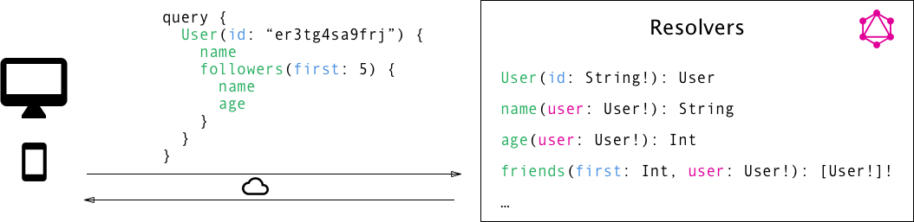

## Introduction
GraphQL is a new API standard that provides a more efficient, powerful and flexible alternative to REST. It was developed and open-sourced by Facebook and is now maintained by a large community of companies and individuals from all over the world.    

> APIs have become ubiquitous components of software infrastructures. In short, an API defines how a client can load data from a server.     

At its core, GraphQL enables declarative data fetching where a client can specify exactly what data it needs from an API. Instead of multiple endpoints that return fixed data structures, a GraphQL server only exposes a single endpoint and responds with precisely the data a client asked for.

Most applications today have the need to fetch data from a server where that data is stored in a database. It’s the responsibility of the API to provide an interface to the stored data that fits an application’s needs. GraphQL is often confused with being a database technology. This is a misconception, GraphQL is a query language for APIs - not databases. In that sense it’s database agnostic and effectively can be used in any context where an API is used.

## A more efficient Alternative to REST

REST has been a popular way to expose data from a server. When the concept of REST was developed, client applications were relatively simple and the development pace wasn’t nearly where it is today. REST thus was a good fit for many applications. However, the API landscape has radically changed over the last couple of years. In particular, there are three factors that have been challenging the way APIs are designed:
1. **Increased mobile usage creates need for efficient data loading** - Increased mobile usage, low-powered devices and sloppy networks were the initial reasons why Facebook developed GraphQL. GraphQL minimizes the amount of data that needs to be transferred over the network and thus majorly improves applications operating under these conditions.
2. **Variety of different frontend frameworks and platforms** - The heterogeneous landscape of frontend frameworks and platforms that run client applications makes it difficult to build and maintain one API that would fit the requirements of all. With GraphQL, each client can access precisely the data it needs.
3. **Fast development & expectation for rapid feature development** - Continuous deployment has become a standard for many companies, rapid iterations and frequent product updates are indispensable. With REST APIs, the way data is exposed by the server often needs to be modified to account for specific requirements and design changes on the client-side. This hinders fast development practices and product iterations.

## Data Fetching with REST vs GraphQL

With a REST API, you would typically gather the data by accessing multiple endpoints. In the example, these could be `/users/<id>` endpoint to fetch the initial user data. Secondly, there’s likely to be a `/users/<id>/posts` endpoint that returns all the posts for a user. The third endpoint will then be the `/users/<id>/followers` that returns a list of followers per user. In GraphQL on the other hand, you’d simply send a single query to the GraphQL server that includes the concrete data requirements. The server then responds with a JSON object where these requirements are fulfilled.

One of the most common problems with REST is that of over- and underfetching. This happens because the only way for a client to download data is by hitting endpoints that return fixed data structures. It’s very difficult to design the API in a way that it’s able to provide clients with their exact data needs.

Overfetching means that a client downloads more information than is actually required in the app. Imagine for example a screen that needs to display a list of users only with their names. In a REST API, this app would usually hit the `/users` endpoint and receive a JSON array with user data. This response however might contain more info about the users that are returned, e.g. their birthdays or addresses - information that is useless for the client because it only needs to display the users’ names. 

Another issue is underfetching and the n+1-requests problem. Underfetching generally means that a specific endpoint doesn’t provide enough of the required information. The client will have to make additional requests to fetch everything it needs. This can escalate to a situation where a client needs to first download a list of elements, but then needs to make one additional request per element to fetch the required data.

As an example, consider the same app would also need to display the last three followers per user. The API provides the additional endpoint `/users/<user-id>/followers`. In order to be able to display the required information, the app will have to make one request to the `/users` endpoint and then hit the `/users/<user-id>/followers` endpoint for each user. 

GraphQL uses a strong type system to define the capabilities of an API. All the types that are exposed in an API are written down in a schema using the GraphQL Schema Definition Language (SDL). This schema serves as the contract between the client and the server to define how a client can access the data.

Once the schema is defined, the teams working on frontend and backends can do their work without further communication since they both are aware of the definite structure of the data that’s sent over the network. Frontend teams can easily test their applications by mocking the required data structures. Once the server is ready, the switch can be flipped for the client apps to load the data from the actual API.

## The Schema Definition Language (SDL)

GraphQL has its own type system that’s used to define the schema of an API. The syntax for writing schemas is called Schema Definition Language (SDL). Here is an example of how we can use the SDL to define a simple type called Person:
```graphql
type Person {
  name: String!
  age: Int!
}
```
This type has two fields, they’re called name and age and are respectively of type String and Int. The ! following the type means that this field is required. It’s also possible to express relationships between types. In the example of a blogging application, a Person could be associated with a Post. Conversely, the other end of the relationship needs to be placed on the Person type:
```graphql
type Post {
  title: String!
  author: Person!
}

type Person {
  name: String!
  age: Int!
  posts: [Post!]!
}
```

## Fetching Data with Queries

When working with REST APIs, data is loaded from specific endpoints. Each endpoint has a clearly defined structure of the information that it returns. This means that the data requirements of a client are effectively encoded in the URL that it connects to.

The approach that’s taken in GraphQL is radically different. Instead of having multiple endpoints that return fixed data structures, GraphQL APIs typically only expose a single endpoint. This works because the structure of the data that’s returned is not fixed. Instead, it’s completely flexible and lets the client decide what data is actually needed. That means that the client needs to send more information to the server to express its data needs - this information is called a query.

Let’s take a look at an example query that a client could send to a server:
```graphql
{
  allPersons {
    name
  }
}
```
The allPersons field in this query is called the **root field** of the query. Everything that follows the root field, is called the **payload** of the query. The only field that’s specified in this query’s payload is name. This query would return a list of all persons currently stored in the database. Here’s an example response:
```graphql
{
  "allPersons": [
    { "name": "Johnny" },
    { "name": "Sarah" },
    { "name": "Alice" }
  ]
}
```
Notice that each person only has the name in the response, but the age is not returned by the server. That’s exactly because name was the only field that was specified in the query. If the client also needed the persons’ age, all it has to do is slightly adjust the query and include the new field in the query’s payload. One of the major advantages of GraphQL is that it allows for naturally querying nested information. For example, if we wanted to load all the posts that a Person has written, we could simply follow the structure of our types to request this information. In GraphQL, each field can have zero or more arguments if that’s specified in the schema. For example, the allPersons field could have a last parameter to only return up to a specific number of persons. Here’s what a corresponding query would look like:
```graphql
{
  allPersons(last: 2) {
    name
    posts {
        title
    }
  }
}
```

## Writing Data with Mutations
Next to requesting information from a server, the majority of applications also need some way of making changes to the data that’s currently stored in the backend. With GraphQL, these changes are made using so-called mutations. There generally are three kinds of mutations:
- creating new data
- updating existing data
- deleting existing data
Mutations follow the same syntactical structure as queries, but they always need to start with the mutation keyword. Here’s an example for how we might create a new Person:
```graphql
mutation {
  createPerson(name: "Bob", age: 36) {
    id
    name
    age
  }
}
```
Like with a query, we’re also able to specify a payload for a mutation in which we can ask for different properties of the new Person object. In our case, we’re asking for the name and the age - though admittedly that’s not super helpful in our example since we obviously already know them as we pass them into the mutation. However, being able to also query information when sending mutations can be a very powerful tool that allows us to retrieve new information from the server in a single roundtrip. One pattern you’ll often find is that GraphQL types have unique IDs that are generated by the server when new objects are created. 

## Realtime Updates with Subscriptions

Another important requirement for many applications today is to have a realtime connection to the server in order to get immediately informed about important events. For this use case, GraphQL offers the concept of subscriptions.

When a client subscribes to an event, it will initiate and hold a steady connection to the server. Whenever that particular event then actually happens, the server pushes the corresponding data to the client. Unlike queries and mutations that follow a typical “request-response-cycle”, subscriptions represent a stream of data sent over to the client. Subscriptions are written using the same syntax as queries and mutations. Here’s an example where we subscribe on events happening on the Person type:
```graphql
subscription {
  newPerson {
    name
    age
  }
}
```
After a client sent this subscription to a server, a connection is opened between them. Then, whenever a new mutation is performed that creates a new Person, the server sends the information about this person over to the client.


## Defining a Schema
The schema is one of the most important concepts when working with a GraphQL API. It specifies the capabilities of the API and defines how clients can request the data. It is often seen as a contract between the server and client.

Generally, a schema is simply a collection of GraphQL types. However, when writing the schema for an API, there are some special root types:
```graphql
type Query { ... }
type Mutation { ... }
type Subscription { ... }
```
The Query, Mutation, and Subscription types are the entry points for the requests sent by the client. Putting it all together, this is the full schema for all the queries and mutation seen so far:
```graphql
type Query {
  allPersons(last: Int): [Person!]!
  allPosts(last: Int): [Post!]!
}

type Mutation {
  createPerson(name: String!, age: Int!): Person!
  updatePerson(id: ID!, name: String!, age: String!): Person!
  deletePerson(id: ID!): Person!
}

type Subscription {
  newPerson: Person!
}

type Person {
  id: ID!
  name: String!
  age: Int!
  posts: [Post!]!
}

type Post {
  title: String!
  author: Person!
}
```

## Resolver Functions

The payload of a GraphQL query (or mutation) consists of a set of fields. In the GraphQL server implementation, each of these fields actually corresponds to exactly one function that’s called a resolver. The sole purpose of a resolver function is to fetch the data for its field.

When the server receives a query, it will call all the functions for the fields that are specified in the query’s payload. It thus resolves the query and is able to retrieve the correct data for each field. Once all resolvers returned, the server will package data up in the format that was described by the query and send it back to the client.

A resolver function receives four arguments:
- **obj** - The previous object, which for a field on the root Query type is often not used.
- **args** The arguments provided to the field in the GraphQL query.
- **context** A value which is provided to every resolver and holds important contextual information like the currently logged in user, or access to a database.
- **info** A value which holds field-specific information relevant to the current query as well as the schema details


## More GraphQL Concepts

Fragments are a handy feature to help to improve the structure and reusability of your GraphQL code. A fragment is a collection of fields on a specific type. Fragments let us construct sets of fields, and then include them in queries where we need to. Example:
```graphql
fragment addressDetails on User {
  name
  street
  zipcode
  city
}

{
  allUsers {
    ... addressDetails
  }
}
```

In GraphQL type definitions, each field can take zero or more arguments. Similar to arguments that are passed into functions in typed programming languages, each argument needs to have a name and a type. In GraphQL, it’s also possible to specify default values for arguments. One of GraphQL’s major strengths is that it lets us send multiple queries in a single request. However, since the response data is shaped after the structure of the fields being requested, we may run into naming issues when we’re sending multiple queries asking for the same fields. The only way to send a query like that would be to use aliases, i.e. specifying names for the query results.

In GraphQL, there are two different kinds of types.
- **Scalar** types represent concrete units of data. The GraphQL spec has five predefined scalars: as String, Int, Float, Boolean, and ID.
- **Object** types have fields that express the properties of that type and are composable. Examples of object types are the User or Post types seen earlier.

In every GraphQL schema, we can define your own scalar and object types. An often cited example for a custom scalar would be a Date type where the implementation needs to define how that type is validated, serialized, and deserialized. GraphQL allows us to define enumerations types (short enums), a language feature to express the semantics of a type that has a fixed set of values. Note that technically enums are special kinds of scalar types. Union types can be used to express that a type should be either of a collection of other types.

An interface can be used to describe a type in an abstract way. It allows us to specify a set of fields that any concrete type, which implements this interface, needs to have. In many GraphQL schemas, every type is required to have an id field. Using interfaces, this requirement can be expressed by defining an interface with this field and then making sure that all custom types implement it:
```graphql
interface Node {
  id: ID!
}

type User implements Node {
  id: ID!
  name: String!
  age: Int!
}
```

## Credits & Attributions:

- [Official GraphQL Documentation](https://graphql.org)
- [How to GraphQL Tutorial](https://www.howtographql.com)

