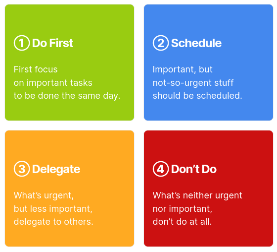
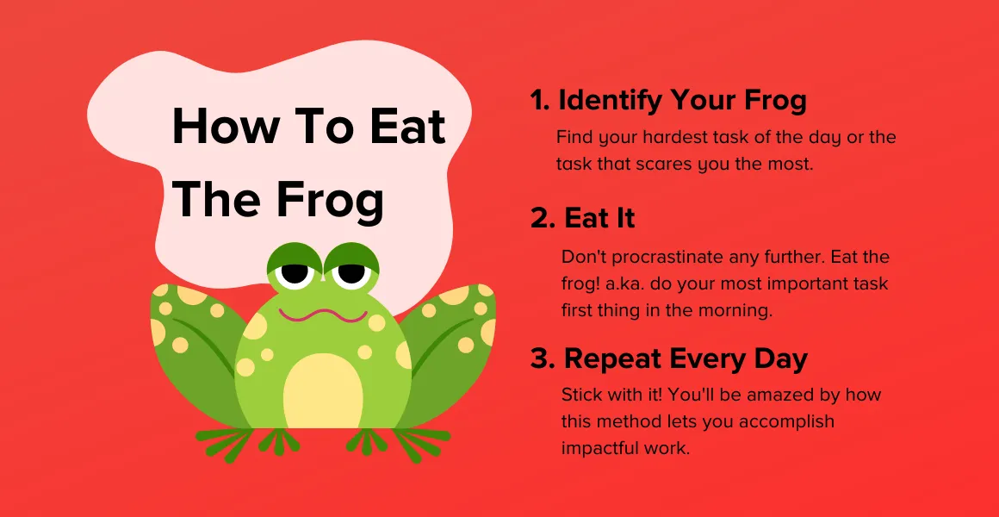

Procrastination is not a time management problem. It is an emotion regulation problem - we delay activities which might make us feel not-so-good today and in the near future. Berking's emotional regulation technique is a scientifically verified counter measure.

Behind procrastination, there is negative affect (thoughts, feelings, moods) about a particular task or the outcome of that task.

Sometimes it is related to a fear of failure, low self-esteem, lack of confidence, feelings of incompetence, etc. These hidden anxieties paint the task in negativity and we end up delaying the task. We participate in aversive tasks which make us feel better in the short term to cope with the negative mood induced by the task.

### **The proposed solution is emotional regulation.**

- Choose the task you procrastinate.
- Bring aversive and negative emotions & thoughts associated with the task into awareness.
- Instruct yourself to tolerate those negative emotions such as boredom, fear of failure, fear of judgment, feelings of incompetence, etc.
- Address those emotions by regulating your emotions in a structured manner. Begin with allowing those emotions to exist. Do not suppress them. Then tell yourself that you are strong, tough, and resilient. Finally, ascribe more emotional meaning to the task and emotionally commit to that task.

---

### The 2-Minute Rule

If a task takes less than two minutes to complete, do it right away. This will help you get a sense of accomplishment and momentum, and it will also prevent small tasks from snowballing into larger ones.

### The 5-Second Rule

When you find yourself procrastinating, count down from five to one. Once you reach one, get up and start working on the task. This will help you break the cycle of procrastination and get started on what you need to do.

Take a moment to imagine how you will feel if you procrastinate on a task. Will you feel stressed, anxious, or guilty? Now imagine how you will feel if you complete the task. Will you feel proud, relieved, or satisfied? Visualizing the positive outcomes of completing a task can help you motivate yourself to get started.

### Eisenhower Matrix

The Eisenhower Matrix is a tool that can help you prioritize your tasks. It divides tasks into four categories:

1. **Urgent and Important**: These tasks are the most important and should be done first.
2. **Not Urgent and Important**: These tasks are important but not urgent, and they can be scheduled for a later time.
3. **Urgent and Not Important**: These tasks are not important but they are urgent, and they can be delegated to someone else.
4. **Not Urgent and Not Important**: These tasks are neither important nor urgent, and they can be eliminated.

### Eat the frog

**Eat the frog** is a metaphor for doing the most difficult task first. This is a good strategy because it gets the worst task out of the way and allows you to focus on the easier tasks later.

>Big projects = overwhelmed feelings = procrastination

Large tasks can be overwhelming, so it’s helpful to break them down into smaller, more manageable tasks. This will make the task seem less daunting and help you get started.

Perfectionism is a major cause of procrastination. If you’re constantly worried about making mistakes, you’ll never be able to get started on a task. It’s important to remember that everyone makes mistakes, and that it’s okay to not be perfect.

Your phone is a major distraction, so it’s best to put it in another room when you’re trying to focus on a task. This will help you avoid the temptation to check social media, email, or text messages.      

-----        

## 86 ways to a better living

1. Start your day with a glass of plain water

2. Decide to be happy today

3. Go for a pre breakfast walk

4. Quit smoking

5. Have a healthy breakfast every morning

6. Laughter is the best medicine

7. Spend time in a garden

8. Take responsibilities for your emotions

9. Practice a healthy diet

10. Plan ahead

11. Walk 10 000 steps daily

12. Take a deep breath. It calms the mind

13. Eat regular meals

14. Maintain a healthy weight

15. Listen to your body

16. Include a variety of wholegrain in your healthy diet

17. Talk to your neighbors

18. Don't gossip

19. See all relationship as fruitful

20. Eat a rainbow of fruits and vegetables

21. Keep a healthy perspective on work
    problems

22. Exercise 5 times weekly

23. Keep a sense of humor

24. Eat a variety of nutrient-rich foods

25. Surround yourself with positive image

26. Avoid alcohol and narcotics

27. Be kind to yourself

28. Focus on quality sources of protein

29. Don't compare your life to others

30. Write down your worries

31. Think positive

32. Never skip meals

33. Settle a quarrel before bedtime

34. Go for regular medical check ups

35. Forgive everyone

36. Enjoy healthy fats and avoid unhealthy
    fats

37. Give yourself a present on your birthday

38. Watch a comedy

39. Learn your natural sleep cycle

40. Eat to live, not live to eat

41. Let music fill your heart

42. Discover the benefits of massage

43. Tape a list of goals to your computer

44. Drink at least 8 glasses of plain water
    daily

45. Don't try to resolve everything in a day

46. Never take work to bed

47. Be kind and courteous to your family

48. Downsize your portions

49. Play gentle music quietly in your bedroom

50. Sleep 6-8 hours daily

51. Make time for laughter

52. Limit sugar and salt intake

53. Accept change

54. Grow your own vegetables

55. See life as a journey, not a destination

56. Cut down on processed foods

57. Cultivate positive challenges

58. Do a few exercises during TV ad breaks

59. Manage your stress level

60. Grill, steam, bake and broil your food
    instead of frying

61. Go on a mini-retreat for just one day

62. Take up dancing or a team sport

63. Life is too short to waste time hating
    anyone

64. Avoid all-you-can-eat buffet

65. Create positive self-image on the screen
    of your mind

66. Practice safe sex

67. Enjoy your meal with friends whenever
    possible

68. Stop eating before you're full

69. Time heals almost everything. Give time,
    time.

70. Do some gardening

71. You don't have to win every argument,
    agree to disagree

72. Reduce, but don't deny food treats

73. Write reviews of your most pleasurable
    experiences

74. Climb the stairs at work instead of
    taking elevator

75. Cross a bridge from a problem to a
    solution

76. Take time to chew your food, relishing
    every mouthful

77. Don't take yourself so seriously. No one
    else does.

78. Write a "have done list"

79. Find a silver lining in every cloud

80. Eat a handful of unsalted nuts

81. Give yourself the time and space to enjoy
    life

82. Mix your exercise to prevent boredom

83. See the light at the end of the tunnel

84. Reduce caffeine intake

85. Keep your promises

86. Go to bed early

---

## Flow State

Flow is a unique mental state of effortless engagement. Flow is more than just concentrating or paying attention. Psychologists go so far as to define flow as an altered state of consciousness with several defining features. Those in flow tend to feel so effortlessly engaged in a task that time seems to fly by. They are not easily distracted.      

In contrast with cycles of procrastination, when it can feel impossible to start an activity, during flow it can feel difficult to stop. Flow also tends to diminish feelings of worry or self-judgment, in turn fostering creativity. And people report experiencing a sense of oneness with what they’re doing, allowing for peak performance.     

### Things you can do to get into a flow

1. Do activities where you are intrinsically motivated i.e., things that you find purpose, meaning and enjoyment. This may include participating in a favorite hobby, but also tackling gratifying assignments at work, studying topics you find interesting, or even completing satisfying chores.
2. Balancing personal skill level with the activity's challenge is the key for finding flow. In other words, if a task is too easy, you may get distracted or feel bored. If it’s too challenging, you may become discouraged.
3. Have clear goals for activities and allow assessments/feedback along the way. Moment-to-moment feedback may be enough to motivate deep engagement.
4. Find a quiet environment free from distracting noises or devices
5. Break your tasks into small, specific segments that are easy to track and learn from
6. Set clear end goals that are challenging but not frustratingly so. If you find the task to be tedious, set additional parameters to up the stakes
7. Don't focus on reaching flow entirely. You can still get great work done without being in the flow.
         
---
              
## Acknowledgements:

I [(@vijethph)](https://github.com/vijethph) just found this while browsing Reddit, thought it was good, and put up here with some modifications of my own. The original work and credit all go to whoever posted this up on Reddit (I don't know their name). So, I thank them for sharing this valuable material.
