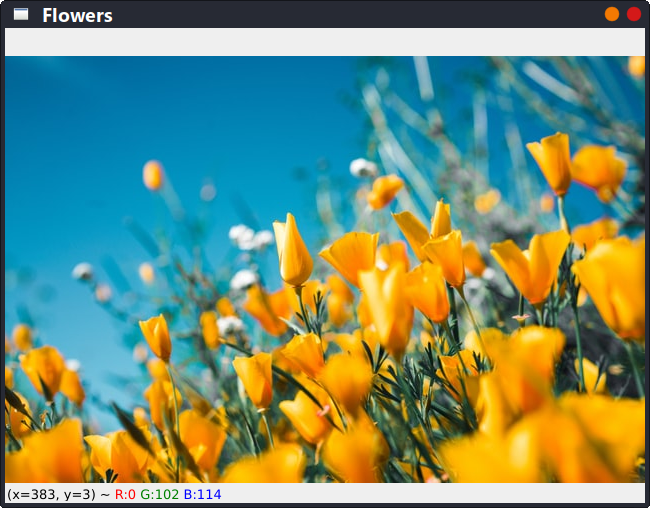
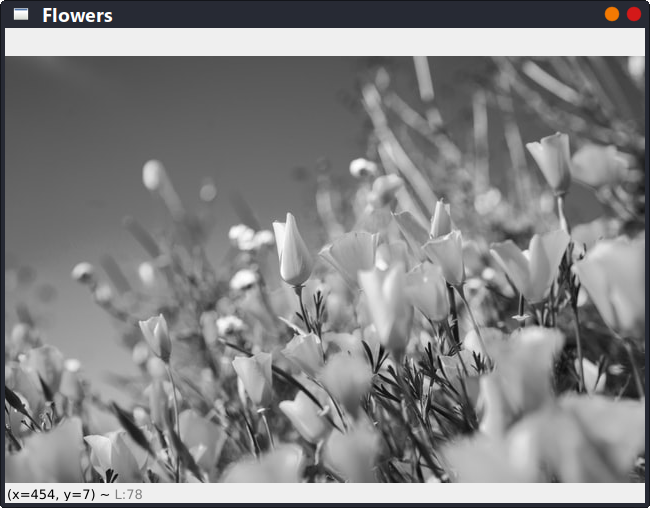
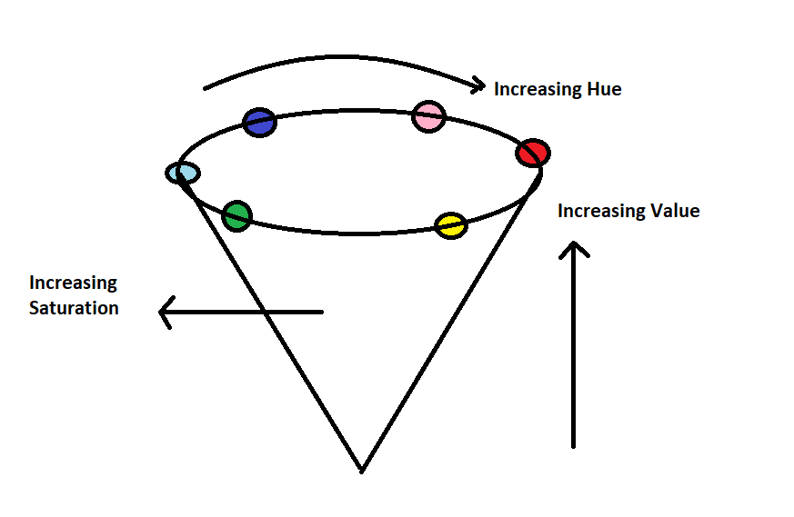

# Introduction to OpenCV in Python

Computer vision is a process by which we can understand the images and videos how they are stored and how we can manipulate and retrieve data from them. Computer vision is the base or mostly used for Artificial Intelligence. Computer vision is playing a major role in self-driving cars, robotics as well as in photo correction apps.

## Overview

In this article, we will try to know about OpenCV, install it using PIP package manager and implement reading, writing and displaying an image in OpenCV using Python.

## Introduction

OpenCV is a huge open-source library for the computer vision, machine learning, and image processing, which plays a major role in real-time operations which is very important in today’s systems. By using it, one can process images and videos to identify objects, faces, and even handwriting of humans. When it is integrated with various libraries, such as Numpy, Python is capable of processing the OpenCV array structure for analysis. To identify image pattern and its various features we use vector space and perform mathematical operations on these features.

The first OpenCV version was 1.0. OpenCV is released under a BSD license and hence it’s free for both academic and commercial use. It has C, C++, Python and Java interfaces and supports Windows, Linux, Mac OS, iOS and Android. When OpenCV was designed the main focus was real-time applications for computational efficiency. All things are written in optimized C/C++ to take advantage of multi-core processing.

Python is a general purpose programming language started by Guido van Rossum, which became very popular in short time mainly because of its simplicity and code readability. It enables the programmer to express his ideas in fewer lines of code without reducing any readability.

## Installing OpenCV

To install OpenCV, one must have Python and PIP, preinstalled on their system. To check if your system already contains Python, go through the following instructions:
Open the Command Line (cmd in Windows) or console (terminal in Linux and MacOS). Now run the following command:

```sh
python --version
```

If Python is already installed, it will generate a message with the Python version available. If it is not installed, open the official Python website, go through the instructions and install it.

PIP is a package management system used to install and manage software packages/libraries written in Python. These files are stored in a large “online repository” termed as Python Package Index (PyPI).
To check if PIP is already installed on your system, just go to the command line and execute the following command:

```
pip -v
```

If PIP is already installed, it will generate a message with the PIP version available. If it is not installed, open the official Python website, go through the instructions and install it.

OpenCV can be directly downloaded and installed with the use of pip (package manager). To install OpenCV, just go to the command-line and type the following command:

```
pip install opencv-python
```

To check if OpenCV is correctly installed, just run the following commands to perform a version check:

```python
python
>>>import cv2
>>>print(cv2.__version__)
```

## Reading and displaying an image in OpenCV

To use the OpenCV library in python, we need to install these libraries as a prerequisite:

- Numpy Library (necessary, because OpenCV uses it in the background).
- OpenCV python

To install these libraries, we need to run these pip commands in command line or console:

```sh
pip install opencv-python
pip install numpy
pip install matplotlib
```

To read the images `cv2.imread()` method is used. This method loads an image from the specified file. If the image cannot be read (because of missing file, improper permissions, unsupported or invalid format) then this method returns an empty matrix.

> **Syntax**: cv2.imread(path, flag)

**Parameters**:

- **path**: A string representing the path of the image to be read.
- **flag**: It specifies the way in which image should be read. It’s default value is cv2.IMREAD_COLOR
- **Return Value**: This method returns an image that is loaded from the specified file.

Note: The image should be in the working directory or a full path of image should be given.

All three types of flags are described below:

- `cv2.IMREAD_COLOR`: It specifies to load a color image. Any transparency of image will be neglected. It is the default flag. Alternatively, we can pass integer value 1 for this flag.
- `cv2.IMREAD_GRAYSCALE`: It specifies to load an image in grayscale mode. Alternatively, we can pass integer value 0 for this flag.
- `cv2.IMREAD_UNCHANGED`: It specifies to load an image as such including alpha channel. Alternatively, we can pass integer value -1 for this flag.

`cv2.imshow()` method is used to display an image in a window. The window automatically fits to the image size.

> **Syntax**: cv2.imshow(window_name, image)

**Parameters**:

- **window_name**: A string representing the name of the window in which image needs to be displayed.
- **image**: It is the image that is to be displayed.
- **Return Value**: It doesn’t return anything.

Below codes are implementations to read images and display images on the screen using OpenCV and matplotlib libraries functions.

### Example 1 - Coloured Image Mode:

```python
# Python code to read image in coloured mode
import cv2

# To read image from disk, we use cv2.imread() function, in below method:
img = cv2.imread("flowers.png", cv2.IMREAD_COLOR)

# Creating GUI window to display an image on screen
# First parameter is the window's title (should be in string format)
# Second parameter is the image array
cv2.imshow("Flowers", img)

# To hold the window on screen, we use cv2.waitKey() method. Once it detects the close input, it will release the control to the next line
# First parameter is for holding screen for specified milliseconds
# It should be a positive integer. If 0 is passed as a parameter, then it will hold the screen until user closes it.
# (this is necessary to avoid Python kernel from crashing)
cv2.waitKey(0)

# This is for removing/deleting created GUI window from screen and memory
cv2.destroyAllWindows()
```

### Output:



### Example 2 - Grayscale Image Mode

```python
# Python program to explain cv2.imread() method in grayscale mode

# importing cv2 module
import cv2

# path for the image file
path = r'flowers.png'

# Using cv2.imread() method
# Using 0 to read image in grayscale mode
img = cv2.imread(path, 0)

# Displaying the image
cv2.imshow('Flowers', img)
cv2.waitKey(0)
cv2.destroyAllWindows()
```

### Output:



## Writing an image in OpenCV

`cv2.imwrite()` method is used to save an image to any storage device. This will save the image according to the specified format in the current working directory or mentioned directory.

> **Syntax**: cv2.imwrite(filename, image)

**Parameters**:

- **filename**: A string representing the file name. The filename must include image format like .jpg, .png, etc.
- **image**: It is the image that is to be saved.
- **Return Value**: It returns true if image is saved successfully.

```python
# Python program to explain cv2.imwrite() method to save images

# importing cv2 module
import cv2

# importing os module
import os

# Image path
image_path = r'/home/vijethph/Codes/LocalDevelopment/flowers.png'

# Image directory
directory = r'/home/vijethph/Codes/LocalDevelopment'

# Using cv2.imread() method to read the image
img = cv2.imread(image_path)

# Change the current directory to specified directory
os.chdir(directory)

# List files and directories in '/home/vijethph/Codes/LocalDevelopment/'
print("Before saving image:")
print(os.listdir(directory))

# Filename for new file
filename = 'savedImage.jpg'

# Using cv2.imwrite() method for saving the image
cv2.imwrite(filename, img)

# List files and directories in '/home/vijethph/Codes/LocalDevelopment/'
print("After saving image:")
print(os.listdir(directory))

print('Successfully saved!')
```

### Output:

```sh
Before saving image:
['flowers.png']
After saving image:
['flowers.png', 'savedImage.jpg']
Successfully saved!
```

## Color Spaces in OpenCV

Color spaces are a way to represent the color channels present in the image that gives the image that particular hue. There are several different color spaces and each has its own significance.
Some of the popular color spaces are RGB (Red, Green, Blue), CMYK (Cyan, Magenta, Yellow, Black), HSV (Hue, Saturation, Value), etc.

     

**BGR color space**: OpenCV’s default color space is RGB. However, it actually stores color in the BGR format. It is an additive color model where the different intensities of Blue, Green and Red give different shades of color.

   

**HSV color space**: It stores color information in a cylindrical representation of RGB color points. It attempts to depict the colors as perceived by the human eye. Hue value varies from 0-179, Saturation value varies from 0-255 and Value value varies from 0-255. It is mostly used for color segmentation purpose.

   

**CMYK color space**: Unlike, RGB it is a subtractive color space. The CMYK model works by partially or entirely masking colors on a lighter, usually white, background. The ink reduces the light that would otherwise be reflected. Such a model is called subtractive because inks “subtract” the colors red, green and blue from white light. White light minus red leaves cyan, white light minus green leaves magenta, and white light minus blue leaves yellow.

## Arithmetic Operations in OpenCV

Arithmetic Operations like Addition, Subtraction, and Bitwise Operations(AND, OR, NOT, XOR) can be applied to the input images. These operations can be helpful in enhancing the properties of the input images. The Image arithmetics are important for analyzing the input image properties. The operated images can be further used as an enhanced input image, and many more operations can be applied for clarifying, thresholding, dilating etc of the image.

### Addition of Image:

We can add two images by using function `cv2.add()`. This directly adds up image pixels in the two images.

> **Syntax**: cv2.add(img1, img2)

But adding the pixels is not an ideal situation. So, we use `cv2.addweighted()` function. Remember, both images should be of equal size and depth.

> **Syntax**: cv2.addWeighted(img1, wt1, img2, wt2, gammaValue)

**Parameters**:

- **img1**: First Input Image array(Single-channel, 8-bit or floating-point)
- **wt1**: Weight of the first input image elements to be applied to the final image
- **img2**: Second Input Image array(Single-channel, 8-bit or floating-point)
- **wt2**: Weight of the second input image elements to be applied to the final image
- **gammaValue**: Measurement of light

### Subtraction of Images:

Just like addition, we can subtract the pixel values in two images and merge them with the help of `cv2.subtract()` function. The images should be of equal size and depth.

> **Syntax**: cv2.subtract(src1, src2)

## Conclusion

Compared to other languages like C/C++, Python is slower. But another important feature of Python is that it can be easily extended with C/C++. This feature helps us to write computationally intensive codes in C/C++ and create a Python wrapper for it so that we can use these wrappers as Python modules. This gives us two advantages: first, our code is as fast as original C/C++ code (since it is the actual C++ code working in background) and second, it is very easy to code in Python. This is how OpenCV-Python works, it is a Python wrapper around original C++ implementation.

And the support of Numpy makes the task more easier. Numpy is a highly optimized library for numerical operations. It gives a MATLAB-style syntax. All the OpenCV array structures are converted to-and-from Numpy arrays. So whatever operations you can do in Numpy, you can combine it with OpenCV, which increases number of weapons in your arsenal. Besides that, several other libraries like SciPy, Matplotlib which supports Numpy can be used with this.

So OpenCV-Python is an appropriate tool for fast prototyping of computer vision problems.

## Credits and Attributions

- [OpenCV-Python Tutorials](https://opencv-python-tutroals.readthedocs.io/en/latest/index.html)

- [GeeksforGeeks OpenCV Tutorials](https://www.geeksforgeeks.org/opencv-python-tutorial/)
