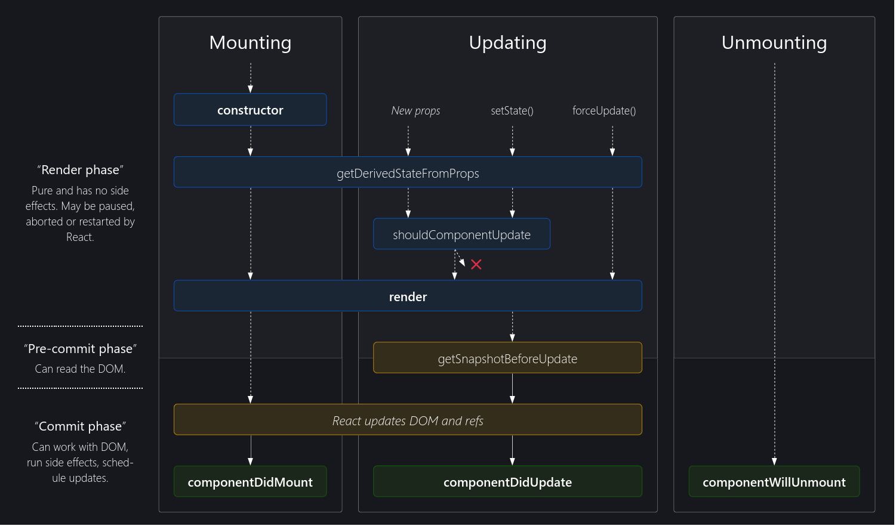

### React.js Basics
React.js is a Javascript library for building user interfaces using components. Components are used for rendering and updating user interfaces. They are regular Javascript functions which return renderable results (typically JSX). ReactDOM is the interface to the web, as it brings real HTML elements to the screen, and therefore responsible for working with DOM. React manages components, props (data passed from components), context (component-wide data), states (internal data of components) and informs ReactDOM about the updates in them. React uses virtual DOM, which determines how the component tree currently looks like, and what it should look like in the end. ReactDOM receives the differences (i.e., required changes) and then manipulates the real DOM. For every state change, the entire component (and its children) in which the state is changed, gets re-executed/re-evaluated. But re-evaluating the components **is not equal to** re-rendering the DOM. DOM only updates the changes in the component, keeping the rest of things intact.  

React makes sure that the default value passed to useState is considered only once: during initialization of the associated component. During first run, useState creates a new state variable which is handed off to React, and therefore managed by React. React memorizes the default value for that state variable, and the component in which it is declared; and uses this variable for subsequent re-evaluations of the component. 

Calling the setXYZ function for the state variable xyz does not immediately change the value for that variable; it schedules a state update by passing the new value. These scheduled state changes are usually processed very fast; but its upto React to take up / postpone these. But the order of scheduled state changes for any particular state variable remains intact. As multiple state updates can be scheduled at the same time, it is recommended to use function form (example: `setSomeVar( (prevVar) => { return prevVar-1; }`) for setting state variables.

If there are multiple setState function calls declared one after another, instead of component getting re-evaluated twice, React will batch those state updates together, as long as it is in a one long synchronous process without any callbacks/promises in between the statements.

### JSX Limitations

1. Cannot have adjacent root level JSX elements, only one element is allowed. We cannot return more than one "root" JSX element, and its also not possible to store more than one "root" JSX element in a variable. **Solution:** always wrap adjacent elements with a `div`. It doesn't have to be a `div`, any element can do the trick.
    > Another approach is to return a native JS array, which has JSX elements as array items. But warning: each child in array should have unique "key" prop.
2. The `div` approach leads to `div soup`, where we have too many nested React Components, and all those need `div`s.
    > In bigger apps, we can easily end up with tons of unnecessary `div`s (or other elements) which add no semantic meaning or structure to the page, but are only there because of JSX requirement. A solution would be to create a `Wrapper` component, which just returns `props.children`, so any number of adjacent JSX elements can be enclosed.      

### Fragments
React comes with a built-in wrapper component called Fragment, which can be accessed using `<React.Fragment>`, `<Fragment>` or use this method:
```jsx
return ( // this depends on project setup / build workflow for support
    <>
        <h2>Hi there!</h2>
        <p>Hello everyone</p>
    </>
 );
```
Fragment is an empty wrapper component. It doesn't render any real HTML element to the DOM. But it fulfills JSX requirements.    
 

### React Portals
Semantically and from a "clean HTML structure" perspective, having nested modals (and sidebars, drawers, other dialogs) isn't ideal. It is an overlay to the entire page, which is rendered separately. It is similar to styling a div like a button and adding an event listener to it: it'll work, but it is not a good practice.    
React portals can help render code written for overlay elements in a different section of resultant page, without making changes to existing JSX code structure. Portals need 2 things:
1. A place where the Component needs to be shifted to
2. Let Component know that there is a portal to that place     
To implement it, go to HTML file and add divs (with ids) along with `<div id="root">` as adjacent elements. Then call `ReactDOM.createPortal()` method. It takes 2 things: 
1. React node to be rendered (as JSX), and 
2. A pointer to the container in real DOM where this React node will be rendered (mentioned using `document.getElementById()`)   

### References (refs)
Refs allow us to get access to other DOM elements and work with them. With refs we can setup a connection between a HTML element which is being rendered in the end, and other JS code. To use it, call `useRef()` inside functional component body. It takes a default value which can be initialized (or left empty), and returns a value which allows to work with it later.      
    
To connect a ref to a HTML element, use the `ref` prop (built-in). Ex: `<p ref={someRef} >Hello</p>`. For the first time React renders JSX code, it'll assign native DOM element (rendered for this HTML element) to declared ref variable.    
      
The ref variable is an object, which always has a `current` prop, which holds the actual value that ref is connected with (real DOM node). This should not be used for manipulation (as React should handle it), but can be used for reading input. Components which use refs can be called as Uncontrolled Components, as they just fetch value using default HTML behaviour. Components which use state can be called as Controlled Components.    

### React Memo and useCallback()
React.memo is a higher order component. If our component renders the same result given the same props, we can wrap it in a call to React.memo for a performance boost in some cases by memoizing the result. This means that React will skip rendering the component, and reuse the last rendered result. This is only for functional components (not class-based). This checks for the props a component gets; it checks the new value for props and compares it with previous values, re-evaluating only based on changes.

React.memo only checks for prop changes. If our function component wrapped in React.memo has a useState, useReducer or useContext Hook in its implementation, it will still re-render when state or context change. By default it will only shallowly compare complex objects in the props object. If we want control over the comparison, we can also provide a custom comparison function as the second argument. React.memo works only for props which are of primitive types like String, Boolean etc., but not arrays and objects.

However, this optimization comes at a cost. React needs to store both old and new prop values in memory and compare them, while simultaneously handling rendering updates of components. It is like trading performance cost of re-evaluating component to performance cost of comparing props, so it depends on number of props, child components and complexity.

useMemo is a React hook which allows us to memoize/store any kind of data. First argument requires a function which should return what we want to store, and second argument is an array of dependencies which should get updated if they are used in function. Pass a "create" function and an array of dependencies. useMemo will only recompute the memoized value when one of the dependencies has changed. This optimization helps to avoid expensive calculations on every render. If no array is provided, a new value will be computed on every render.

`useCallback()` returns a memoized callback. Pass an inline callback and an array of dependencies. useCallback will return a memoized version of the callback that only changes if one of the dependencies has changed. This is useful when passing callbacks to optimized child components that rely on reference equality to prevent unnecessary renders (e.g. shouldComponentUpdate). useCallback also needs a second argument: an array of dependencies, similar to useEffect

Functions are closures in JavaScript, i.e., when the functions are defined, all the variables being used in the function are locked (even the variables defined outside, but used inside the function). Hence, to allow modification of function object definition (as per use cases), the second argument to useCallback is required.

### Class Components
Classes are a default JavaScript feature, not a React feature. Class components should have a function named `render()` which defines the to-be-rendered output. `render()` method does not receive props; class needs to inherit Component class for that. With the exception of Error Boundaries, there is no reason to use class components, as functional components are much preferred. Class-based components cannot use React Hooks, but they can work together with functional components.   

`constructor()` is used to initialize state, which is always an object in class components. setState() is used to change state, which takes an object (new state), but it doesn't override the old state. React merges the new state with the old state behind the scenes. It can also take a function with old state as parameter, and return new state as an object. We can use specific methods to class components to run at different points in their life cycle. Some of them are:
- `componentDidMount()` - called when the component was just mounted (evaluated & rendered to the DOM). Equivalent to useEffect with no dependencies
- `componentDidUpdate()` - called when the component was updated (state changed). Equivalent to useEffect with some dependencies
- `componentDidUnmount()` - called right before the component is unmounted (removed from the DOM). Equivalent to useEffect cleanup function  

 
There are 2 ways to use context variables within class components: using `<Context.Consumer />` , or by using a static property. With useContext, we can listen to multiple contexts in the same functional component by calling useContext multiple times and pointing at different contexts. This is not possible in class-based components, where only one context can be connected to one class component.  

Error boundaries can be used to transport errors from one component to another and display them. Error boundaries are regular class-based components, with one difference: they implement `componentDidCatch()` method. There is no such equivalent for functional components. Note that error boundaries only catch errors in the components below them in the tree. An error boundary can’t catch an error within itself. If an error boundary fails trying to render the error message, the error will propagate to the closest error boundary above it.

## Credits and Attributions

- [Official React Documentation](https://reactjs.org)
- [React - The Complete Guide](https://www.udemy.com/course/react-the-complete-guide-incl-redux) by Maximilian Schwarzmüller
